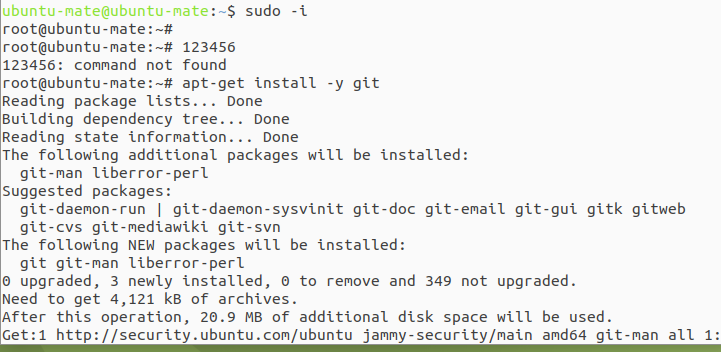
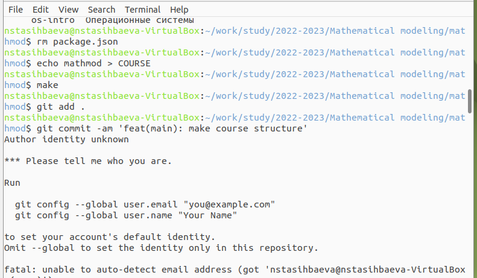
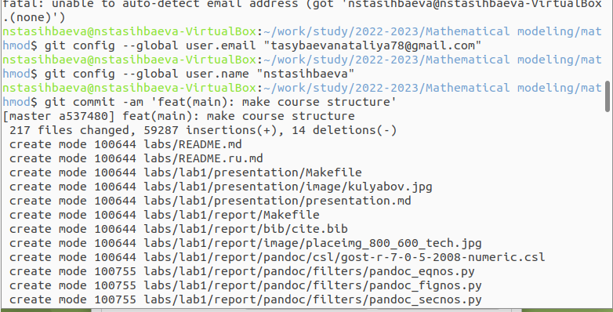
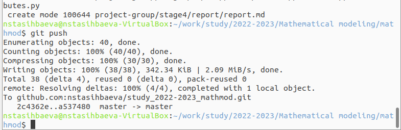
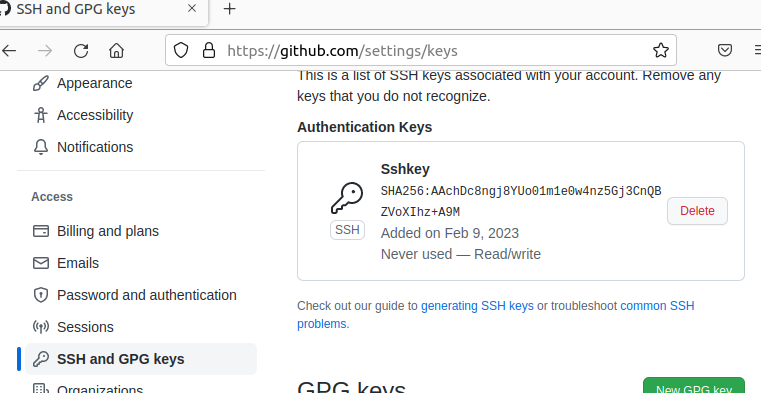
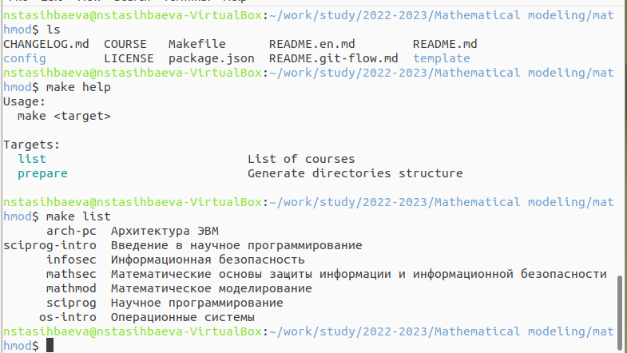

---
## Front matter
title: "Шаблон отчёта по лабораторной работе"
subtitle: "Простейший вариант"
author: "Дмитрий Сергеевич Кулябов"

## Generic otions
lang: ru-RU
toc-title: "Содержание"

## Bibliography
bibliography: bib/cite.bib
csl: pandoc/csl/gost-r-7-0-5-2008-numeric.csl

## Pdf output format
toc: true # Table of contents
toc-depth: 2
lof: true # List of figures
lot: true # List of tables
fontsize: 12pt
linestretch: 1.5
papersize: a4
documentclass: scrreprt
## I18n polyglossia
polyglossia-lang:
  name: russian
  options:
	- spelling=modern
	- babelshorthands=true
polyglossia-otherlangs:
  name: english
## I18n babel
babel-lang: russian
babel-otherlangs: english
## Fonts
mainfont: PT Serif
romanfont: PT Serif
sansfont: PT Sans
monofont: PT Mono
mainfontoptions: Ligatures=TeX
romanfontoptions: Ligatures=TeX
sansfontoptions: Ligatures=TeX,Scale=MatchLowercase
monofontoptions: Scale=MatchLowercase,Scale=0.9
## Biblatex
biblatex: true
biblio-style: "gost-numeric"
biblatexoptions:
  - parentracker=true
  - backend=biber
  - hyperref=auto
  - language=auto
  - autolang=other*
  - citestyle=gost-numeric
## Pandoc-crossref LaTeX customization
figureTitle: "Рис."
tableTitle: "Таблица"
listingTitle: "Листинг"
lofTitle: "Список иллюстраций"
lotTitle: "Список таблиц"
lolTitle: "Листинги"
## Misc options
indent: true
header-includes:
  - \usepackage{indentfirst}
  - \usepackage{float} # keep figures where there are in the text
  - \floatplacement{figure}{H} # keep figures where there are in the text
---
# Отчёт по лабораторной работе №1
## По курсу Математическое моделирование
### Подготовила:Тасыбаева Наталья
### Группа НПИбд-02-20
---
# Цель работы

Получить основные навыки работы с git через терминал и веб-сервер, настроить рабочее пространство, в котором в последствии будем выполнять лабораторные работы. Ознакомиться с языком разметки markdown.

# Задание

Выполнить настройку рабочего пространства на Github, после чего выполнить задания из файла git и составить отчёт по всему сделанному согласно рекомендациям из файла markdown.

# Теоретическое введение

Git — система управления версиями с распределенной архитектурой. В отличие от некогда популярных систем вроде CVS и Subversion (SVN), где полная история версий проекта доступна лишь в одном месте, в Git каждая рабочая копия кода сама по себе является репозиторием. Это позволяет всем разработчикам хранить историю изменений в полном объеме.

Разработка в Git ориентирована на обеспечение высокой производительности, безопасности и гибкости распределенной системы.

# Выполнение лабораторной работы

1. Первым делом я установила виртуальную машну с образом Ubuntu для того, чтобы работать в ОС Linux. 
2. Далее я выполнила все рекомендации по настройке рабочего пространства, а именно:
	- Установила утилиты make, mc, emacs, git. 
	
	
	
	- Настроила каталог
	
	
	
	
	
	
	
	- Добавила SSH-ключ
	
	
	
	- В результате клонирования шаблона репозитория получила такую структуру:
	
	
	
3. После я приступила к выполнению пуктов из файла git:
	- Установка имени и параметров электронной почты
	- Параметры установки окончаний строк
	- Установка отображения unicode
	- Создание проекта
		-  Создание страницы «Hello, World»
		-  Создание репозитория- 
		-  Добавление файла в репозиторий
		-  Проверка состояние репозитория
	- Изменение страницы «Hello, World»
	- Индексация изменений
		-  Коммит изменений
		-  Добавьте стандартные теги страницы
		-  История
		-  Получение старых версий
		-  Создание тегов версий
		-  Переключение по имени тега
		-  Просмотр тегов с помощью команды tag
	- Отмена локальных изменений (до индексации)
		- Измените hello.html
		- Проверьте состояние
		- Отмена изменений в рабочем каталоге
	- Отмена проиндексированных изменений (перед коммитом)
		- Измените файл и проиндексируйте изменения
		- Проверьте состояние
		- Выполните сброс буферной зоны
		- Переключитесь на версию коммита
	- Отмена коммитов
		- Измените файл и сделайте коммит
		- Сделайте коммит с новыми изменениями, отменяющими предыдущие
		- Проверьте лог
	- Удаление коммиттов из ветки
	
---
### Работа с системой контроля версий 

---(рис. @fig:001).

{#fig:001 width=70%}

# Выводы

Я получила основные навыки работы с git через терминал и веб-сервер, настроила рабочее пространство, в котором в последствии буду выполнять лабораторные работы. Ознакомилась с языком разметки markdown.

# Список литературы{.unnumbered}

Я использовала только приложенные к работе файлы и рекомендации
