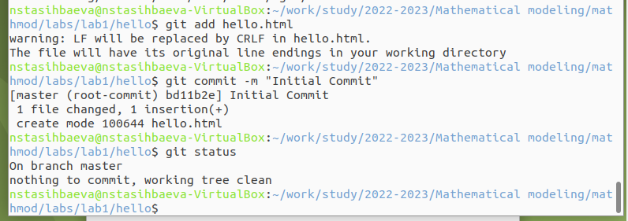

---
## Front matter
title: "Шаблон отчёта по лабораторной работе"
subtitle: "Простейший вариант"
author: "Дмитрий Сергеевич Кулябов"

## Generic otions
lang: ru-RU
toc-title: "Содержание"

## Bibliography
bibliography: bib/cite.bib
csl: pandoc/csl/gost-r-7-0-5-2008-numeric.csl

## Pdf output format
toc: true # Table of contents
toc-depth: 2
lof: true # List of figures
lot: true # List of tables
fontsize: 12pt
linestretch: 1.5
papersize: a4
documentclass: scrreprt
## I18n polyglossia
polyglossia-lang:
  name: russian
  options:
	- spelling=modern
	- babelshorthands=true
polyglossia-otherlangs:
  name: english
## I18n babel
babel-lang: russian
babel-otherlangs: english
## Fonts
mainfont: PT Serif
romanfont: PT Serif
sansfont: PT Sans
monofont: PT Mono
mainfontoptions: Ligatures=TeX
romanfontoptions: Ligatures=TeX
sansfontoptions: Ligatures=TeX,Scale=MatchLowercase
monofontoptions: Scale=MatchLowercase,Scale=0.9
## Biblatex
biblatex: true
biblio-style: "gost-numeric"
biblatexoptions:
  - parentracker=true
  - backend=biber
  - hyperref=auto
  - language=auto
  - autolang=other*
  - citestyle=gost-numeric
## Pandoc-crossref LaTeX customization
figureTitle: "Рис."
tableTitle: "Таблица"
listingTitle: "Листинг"
lofTitle: "Список иллюстраций"
lotTitle: "Список таблиц"
lolTitle: "Листинги"
## Misc options
indent: true
header-includes:
  - \usepackage{indentfirst}
  - \usepackage{float} # keep figures where there are in the text
  - \floatplacement{figure}{H} # keep figures where there are in the text
---
# Отчёт по лабораторной работе №1
## По курсу Математическое моделирование
### Подготовила:Тасыбаева Наталья
### Группа НПИбд-02-20
---
# Цель работы

Получить основные навыки работы с git через терминал и веб-сервер, настроить рабочее пространство, в котором в последствии будем выполнять лабораторные работы. Ознакомиться с языком разметки markdown.

# Задание

Выполнить настройку рабочего пространства на Github, после чего выполнить задания из файла git и составить отчёт по всему сделанному согласно рекомендациям из файла markdown.

# Теоретическое введение

Git — система управления версиями с распределенной архитектурой. В отличие от некогда популярных систем вроде CVS и Subversion (SVN), где полная история версий проекта доступна лишь в одном месте, в Git каждая рабочая копия кода сама по себе является репозиторием. Это позволяет всем разработчикам хранить историю изменений в полном объеме.

Разработка в Git ориентирована на обеспечение высокой производительности, безопасности и гибкости распределенной системы.

# Выполнение лабораторной работы

1. Первым делом я установила виртуальную машну с образом Ubuntu для того, чтобы работать в ОС Linux. 
2. Далее я выполнила все рекомендации по настройке рабочего пространства, а именно:
	- Установила утилиты make, mc, emacs, git. 
	
	{ #fig:001 width=70%}
	
	- Настроила каталог
	
	{ #fig:002 width=70%}
	
	{ #fig:003 width=70%}
	
	{ #fig:004 width=70%}
	
	- Добавила SSH-ключ
	
	{ #fig:005 width=70%}
	
	- В результате клонирования шаблона репозитория получила такую структуру:
	
	{ #fig:006 width=70%}
	
3. После я приступила к выполнению пуктов из файла git:
3.1.1 Установка имени и параметров электронной почты

{ #fig:007 width=70%}

3.1.2 Параметры установки окончаний строк
3.1.3 Установка отображения unicode

{ #fig:008 width=70%}	

3.2.1 Создание страницы «Hello, World»
3.2.2  Создание репозитория- 
3.2.3  Добавление файла в репозиторий
3.2.4  Проверка состояние репозитория

{ #fig:009 width=70%}

3.3.1  Изменение страницы «Hello, World»

{ #fig:010 width=70%}

3.4  Индексация изменений
3.4.1  Коммит изменений

{ #fig:011 width=70%}

.png){ #fig:012 width=70%}

3.4.2  Добавила стандартные теги страницы

.png){ #fig:013 width=70%}

.png){ #fig:014 width=70%}

.png){ #fig:015 width=70%}

.png){ #fig:016 width=70%}

3.4.3  История

{ #fig:017 width=70%}

{ #fig:018 width=70%}

3.4.4  Получение старых версий

.png){ #fig:019 width=70%}

.png){ #fig:019 width=70%}

3.4.5  Создание тегов версий

.png){ #fig:020 width=70%}

3.4.6  Переключение по имени тега

{ #fig:021 width=70%}

3.4.7  Просмотр тегов с помощью команды tag

{ #fig:022 width=70%}

3.5  Отмена локальных изменений (до индексации)
3.5.1  Изменила hello.html

{ #fig:023 width=70%}

3.5.2  Проверила состояние

{ #fig:024 width=70%}

3.5.3  Отмена изменений в рабочем каталоге

{ #fig:025 width=70%}

3.6  Отмена проиндексированных изменений (перед коммитом)
3.6.1  Изменила файл и проиндексировала изменения

.png){ #fig:026 width=70%}

3.6.2  Проверила состояние

{ #fig:027 width=70%}

3.6.3  Выполнила сброс буферной зоны
3.6.4  Переключилась на версию коммита

{ #fig:028 width=70%}

3.7  Отмена коммитов
3.7.1  Изменила файл и сделала коммит

.png){ #fig:029 width=70%}

.png){ #fig:030 width=70%}

3.7.2  Сделала коммит с новыми изменениями, отменяющими предыдущие
{ #fig:031 width=70%}
3.7.3  Проверила лог
3.7.4  Удалила коммитты из ветки

{ #fig:032 width=70%}

---

# Выводы

Я получила основные навыки работы с git через терминал и веб-сервер, настроила рабочее пространство, в котором в последствии буду выполнять лабораторные работы. Ознакомилась с языком разметки markdown.

# Список литературы{.unnumbered}

Я использовала только приложенные к работе файлы и рекомендации
