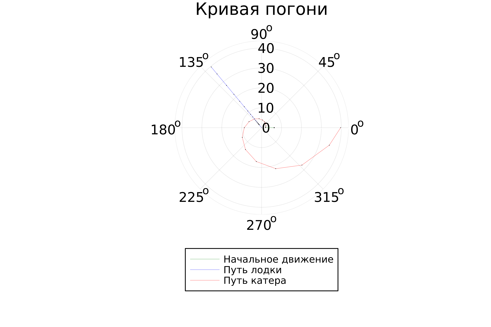
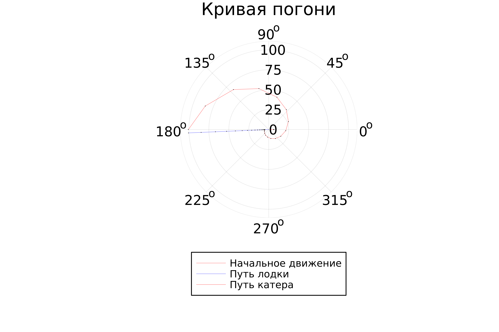
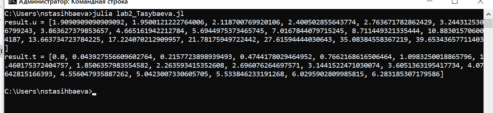

---
## Front matter
lang: ru-RU
title: Презентация лабораторной работы №2
subtitle: Задача о погоне
author:
  - Тасыбаева Наталья Сергеевна
institute:
  - Российский университет дружбы народов, Москва, Россия
date: 18.02.2023

## i18n babel
babel-lang: russian
babel-otherlangs: english

## Formatting pdf
toc: false
toc-title: Содержание
slide_level: 2
aspectratio: 169
section-titles: true
theme: metropolis
header-includes:
 - \metroset{progressbar=frametitle,sectionpage=progressbar,numbering=fraction}
 - '\makeatletter'
 - '\beamer@ignorenonframefalse'
 - '\makeatother'
---
# Подготовила
### Тасыбаева Нататлья Сергеевна 
### Группа НПИбд-02-20
### Студ. билет 1032201735

# Цели и задачи работы

## Цель лабораторной работы

На море в тумане катер береговой охраны преследует лодку браконьеров. Через определенный промежуток времени туман рассеивается, и лодка обнаруживается на расстоянии k км от катера. Затем лодка снова скрывается в тумане и уходит прямолинейно в неизвестном направлении. Известно, что скорость катера в n раза больше скорости браконьерской лодки. 
Необходимо определить по какой траектории необходимо двигаться катеру, чтоб нагнать лодку.

## Задание к лабораторной работе

1. Провести необходимые рассуждения и вывод дифференциальных уравнений, если скорость катера больше скорости лодки в n раз.
2. Построить траекторию движения катера и лодки для двух случаев. 
3. Определить по графику точку пересечения катера и лодки.

## Теоретический материал 

Решение исходной задачи сводится к решению системы из двух дифференциальных уравнений 

$$
 \begin{cases}
   \frac{dr}{dt}=υ
	\\   
	r\frac{d\theta}{dt}=υ\sqrt{n^2-1}
 \end{cases}
$$

с начальными условиями

$$
 \begin{cases}
   \theta_0=0
   \\
	r_0=\frac{k}{n+1}
 \end{cases}
\
$$

$$
 \begin{cases}
   \theta_0=-\pi
   \\
	r_0=\frac{k}{n-1}
 \end{cases}
\
$$

## Условие задачи

На море в тумане катер береговой охраны преследует лодку браконьеров.
Через определенный промежуток времени туман рассеивается, и лодка обнаруживается на расстоянии 6.3 км от катера. 
Затем лодка снова скрывается в тумане и уходит прямолинейно в неизвестном направлении. 
Известно, что скорость катера в 2.3 раза больше скорости браконьерской лодки

## Результаты
1. Траектория движения катера для первого случая

{ #fig:001 width=50% height=50% }

2. Траектория движения катера для второго случая

{ #fig:002 width=50% height=50% }

3. Вычисление тангенсальной и радиальной скоростей

{ #fig:002 width=50% height=50% }

# Выводы по проделанной работе

Рассмотрели задачу о погоне, провели анализ и вывод дифференциальных уравнений, смоделировали ситуацию и нашли точки пересечения катера и лодки.

