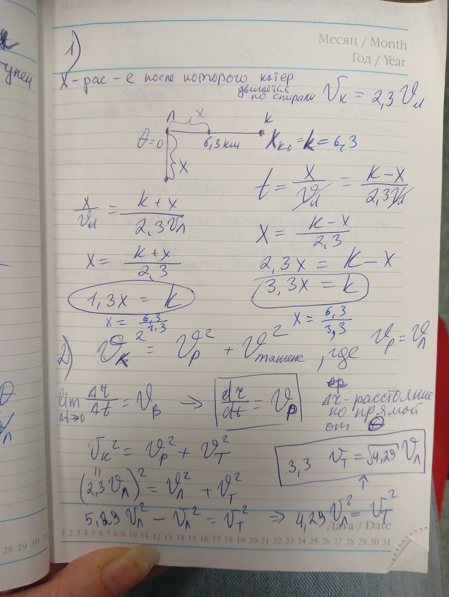
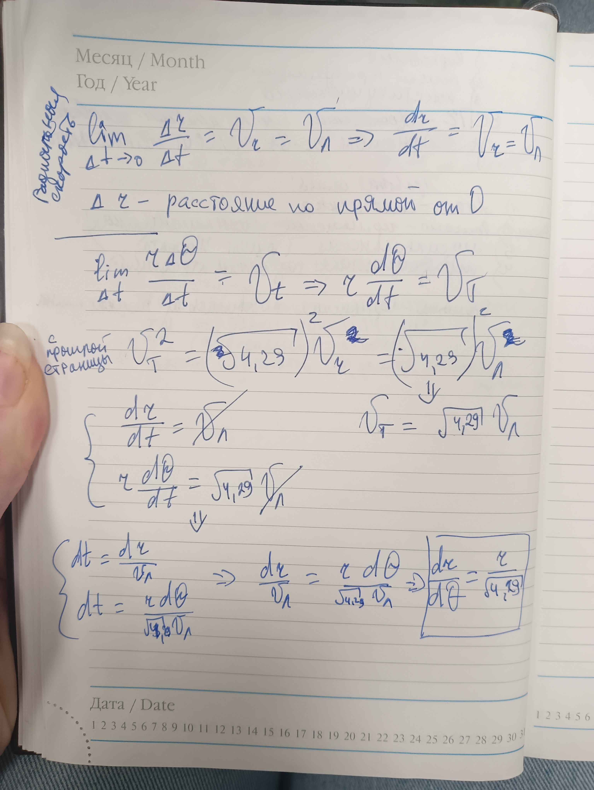
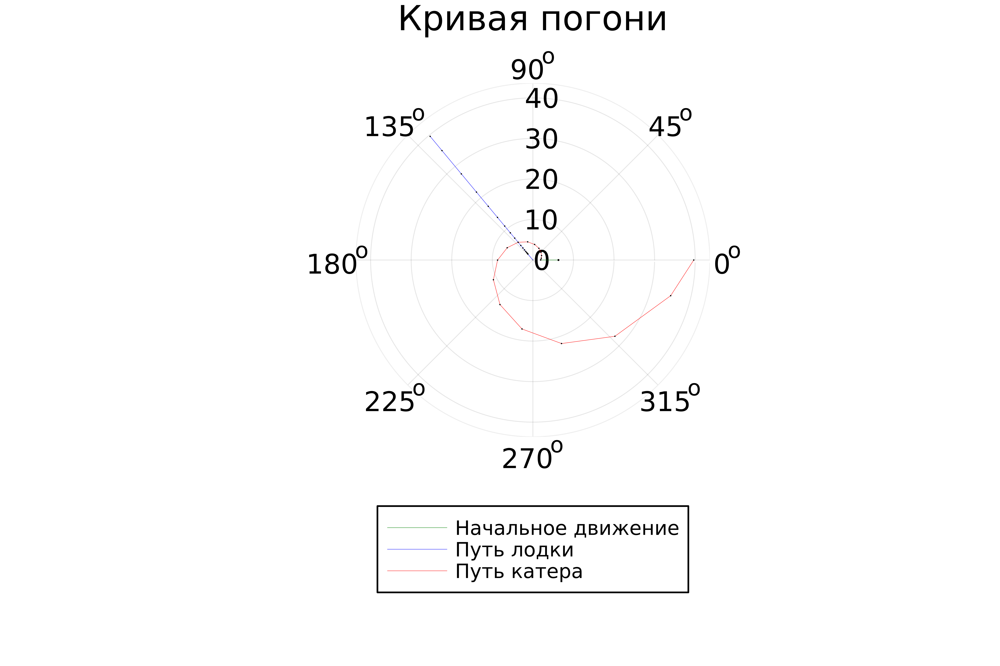
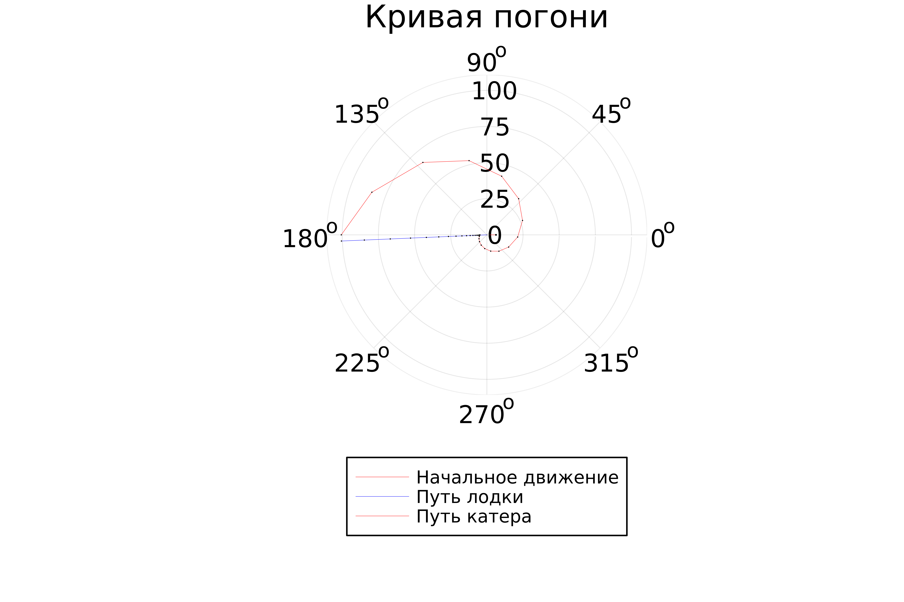
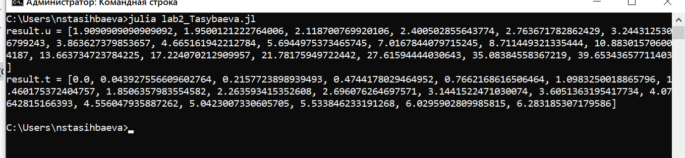

---
## Front matter
title: "Отчёт по лабораторной работе №2"
subtitle: "Задача о погоне"
author: "Тасыбаева Наталья Сергеевна"

## Generic otions
lang: ru-RU
toc-title: "Содержание"

## Bibliography
bibliography: bib/cite.bib
csl: pandoc/csl/gost-r-7-0-5-2008-numeric.csl

## Pdf output format
toc: true # Table of contents
toc-depth: 2
lof: true # List of figures
lot: true # List of tables
fontsize: 12pt
linestretch: 1.5
papersize: a4
documentclass: scrreprt
## I18n polyglossia
polyglossia-lang:
  name: russian
  options:
	- spelling=modern
	- babelshorthands=true
polyglossia-otherlangs:
  name: english
## I18n babel
babel-lang: russian
babel-otherlangs: english
## Fonts
mainfont: PT Serif
romanfont: PT Serif
sansfont: PT Sans
monofont: PT Mono
mainfontoptions: Ligatures=TeX
romanfontoptions: Ligatures=TeX
sansfontoptions: Ligatures=TeX,Scale=MatchLowercase
monofontoptions: Scale=MatchLowercase,Scale=0.9
## Biblatex
biblatex: true
biblio-style: "gost-numeric"
biblatexoptions:
  - parentracker=true
  - backend=biber
  - hyperref=auto
  - language=auto
  - autolang=other*
  - citestyle=gost-numeric
## Pandoc-crossref LaTeX customization
figureTitle: "Рис."
tableTitle: "Таблица"
listingTitle: "Листинг"
lofTitle: "Список иллюстраций"
lotTitle: "Список таблиц"
lolTitle: "Листинги"
## Misc options
indent: true
header-includes:
  - \usepackage{indentfirst}
  - \usepackage{float} # keep figures where there are in the text
  - \floatplacement{figure}{H} # keep figures where there are in the text
---

# Подготовила
### Тасыбаева Нататлья Сергеевна 
### Группа НПИбд-02-20
### Студ. билет 1032201735

# Цель работы

Приведем один из примеров построения математических моделей для выбора правильной стратегии при решении задач поиска. 
Например, рассмотрим задачу преследования браконьеров береговой охраной. 
На море в тумане катер береговой охраны преследует лодку браконьеров. Через определенный промежуток времени туман рассеивается, 
и лодка обнаруживается на расстоянии k км от катера. Затем лодка снова скрывается в тумане и уходит прямолинейно в неизвестном направлении. 
Известно, что скорость катера в n раза больше скорости браконьерской лодки. 
Необходимо определить по какой траектории необходимо двигаться катеру, чтоб нагнать лодку.

# Задание

### Вариант №6
1032201735 mod 70 = 5
5 + 1 = 6
С помощью этих вычислений я выявила, что мой вариант - это вариант №6.

На море в тумане катер береговой охраны преследует лодку браконьеров.
Через определенный промежуток времени туман рассеивается, и лодка обнаруживается на расстоянии 6.3 км от катера. 
Затем лодка снова скрывается в тумане и уходит прямолинейно в неизвестном направлении. 
Известно, что скорость катера в 2.3 раза больше скорости браконьерской лодки
1. Запишите уравнение, описывающее движение катера, с начальными
условиями для двух случаев (в зависимости от расположения катера
относительно лодки в начальный момент времени).
2. Постройте траекторию движения катера и лодки для двух случаев.
3. Найдите точку пересечения траектории катера и лодки 

# Выполнение лабораторной работы

1. Я провела рассчёты, которые представлены на следующем рисунке 

{#fig:001 width=70%}

{#fig:002 width=70%}

2. Далее я написала код 
- - -
using Plots
using DifferentialEquations

const a = 6.3
const n = 2.3

const r0 = a/(n+1)
const r0_2 = a/(n-1)

const T = (o, 2*pi)
const T_2 = (-pi, pi)

function F(u, p, t)
    return u/sqrt(n*n - 1)
end

problem = ODEProblem(F, r0, T)

result = solve(problem, abstol=1e-8, reltol=1e-8)
@show result.u 
@show result.t 
dxR = rand (1:size(result.t)[1])
rAngles = [result.t[dxR] for i in 1:size(result.t)[1]]

plt = plot(proj=:polar, aspect_ratio:equal, dpi = 1200, legend=true, bg=:white)

plot!(plt, xlabel="theta", ylabel="r(t)", title="Кривая погони", legend=:outerbottom)

plot!(plt, [0.0,0.0], [a, r0], label = "Начальное движение", color=:green, lw=0.2)
scatter!(plt, [0.0], [a], label="", mc=:red, ms=0.2)

plot!(plt, [rAngles[1], rAngles[2]], [0.0, result.u[size(result.u)[1]]], label="Путь лодки", color=:blue, lw=0.2)
scatter!(plt, rAngles, result.u, label="", mc=:green, ms=0.005)

plot!(plt, result.t, result.u, xlabel="theta", ylabel="r(t)", label="Путь катера", color=:red, lw=0.2)
scatter!(plt, result.t, result.u, label="", mc=:blue, ms=0.005)

savefig(plt, "lab2-Tasybaeva-01.png")

problem = ODEProblem(F, r0_2 , T_2)
result = solve(problem, abstol=1e-8, reltol=1e-8)
dxR = rand(1:size(result.t)[1])
rAngles = [result.t[dxR] for i in 1:size(result.t)[1]]

plt1 = plot(proj=:polar, aspect_ratio=:equal, dpi = 1200, legend=true, bg=:white)

plot!(plt1, xlabel="theta", ylabel="r(t)", title="Кривая погони", legend=:outerbottom)

plot!(plt1, [0.0,0.0], [a, r0], label = "Начальное движение", color=:red, lw=0.2)
scatter!(plt1, [0.0], [a], label="", mc=:red, ms=0.2)

plot!(plt1, [rAngles[1], rAngles[2]], [0.0, result.u[size(result.u)[1]]], label="Путь лодки", color=:blue, lw=0.2)
scatter!(plt1, rAngles, result.u, label="", mc=:green, ms=0.005)

plot!(plt1, result.t, result.u, xlabel="theta", ylabel="r(t)", label="Путь катера", color=:red, lw=0.2)
scatter!(plt1, result.t, result.u, label="", mc=:blue, ms=0.005)

savefig(plt1, "lab2-Tasybaeva-02.png")

- - -
3. В результате работы программы создались следующие два графика

+ Траектория движения катера для первого случая

{ #fig:001 width=50% height=50% }

+ Траектория движения катера для второго случая

{ #fig:002 width=50% height=50% }

+ Вычисление тангенсальной и радиальной скоростей

{ #fig:002 width=50% height=50% }

# Выводы
Рассмотрели задачу о погоне, провели анализ и вывод дифференциальных уравнений, смоделировали ситуацию и нашли точки пересечения катера и лодки.

::: {#refs}
:::
