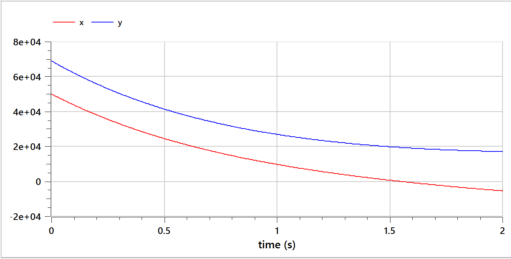

---
## Front matter
lang: ru-RU
title: Презентация лабораторной работы №2
subtitle: Модель боевых действий
author:
  - Тасыбаева Наталья Сергеевна
institute:
  - Российский университет дружбы народов, Москва, Россия
date: 25 февраля 2023

## i18n babel
babel-lang: russian
babel-otherlangs: english

## Formatting pdf
toc: false
toc-title: Содержание
slide_level: 2
aspectratio: 169
section-titles: true
theme: metropolis
header-includes:
 - \metroset{progressbar=frametitle,sectionpage=progressbar,numbering=fraction}
 - '\makeatletter'
 - '\beamer@ignorenonframefalse'
 - '\makeatother'
---

# Цели и задачи работы

## Цель лабораторной работы

```
Рассмотрим некоторые простейшие модели боевых действий – модели
Ланчестера. В противоборстве могут принимать участие как регулярные войска,
так и партизанские отряды. В общем случае главной характеристикой соперников
являются численности сторон. Если в какой-то момент времени одна из
численностей обращается в нуль, то данная сторона считается проигравшей (при
условии, что численность другой стороны в данный момент положительна).
```
## Теоретический материал 

Рассмотри три случая ведения боевых действий:
1. Боевые действия между регулярными войсками
2. Боевые действия с участием регулярных войск и партизанских
отрядов
3. Боевые действия между партизанскими отрядами
В первом случае численность регулярных войск определяется тремя
факторами:
- скорость уменьшения численности войск из-за причин, не связанных с
боевыми действиями (болезни, травмы, дезертирство);
- скорость потерь, обусловленных боевыми действиями
противоборствующих сторон (что связанно с качеством стратегии,
уровнем вооружения, профессионализмом солдат и т.п.);
- скорость поступления подкрепления (задаётся некоторой функцией от
времени).

Во втором случае в борьбу добавляются партизанские отряды. Нерегулярные войска в отличии от постоянной армии менее уязвимы, так как действуют скрытно, в этом случае сопернику приходится действовать неизбирательно, по площадям, занимаемым партизанами. Поэтому считается, что тем потерь партизан, проводящих свои операции в разных местах на некоторой известной территории, пропорционален не только численности армейских соединений, но и численности
самих партизан.
## Условие задачи

Между страной Х и страной У идет война. 
Численность состава войск исчисляется от начала войны, и являются временными функциями xt( ) и yt( ). 
В начальный момент времени страна Х имеет армию численностью 50 000 человек, а в распоряжении страны У армия численностью в 69 000 человек. 
Для упрощения модели считаем, что коэффициенты a b c h постоянны. Также считаем Pt( ) и Q t( ) непрерывные функции.

## Задание к лабораторной работе
Постройте графики изменения численности войск армии Х и армии У для следующих случаев:
1. Модель боевых действий между регулярными войсками

2. Модель ведение боевых действий с участием регулярных войск ипартизанских отрядов 

## Результаты
В результате работы программы на OpenModelica создались следующие два графика
В результате работы программы создались следующие два графика

+ График моделирования боевых действий между регулярными войсками

{ #fig:007 width=50% height=50% }

+ График моделирования боевых действий между регулярными войсками и партизанами

{ #fig:008 width=50% height=50% }

В результате работы программы на Julia создались следующие два графика

+ График моделирования боевых действий между регулярными войсками

{ #fig:009 width=50% height=50% }

+ График моделирования боевых действий между регулярными войсками и партизанами

{ #fig:006 width=50% height=50% }


# Выводы по проделанной работе

Рассмотрели модель боевых действий, провели анализ и вывод дифференциальных уравнений, смоделировали ход боевых действий и выяснили, что войска страны X проигрывают в случае столкновения только регулярных войск и так же в случае столкновения регулярных войск с партизанами.

