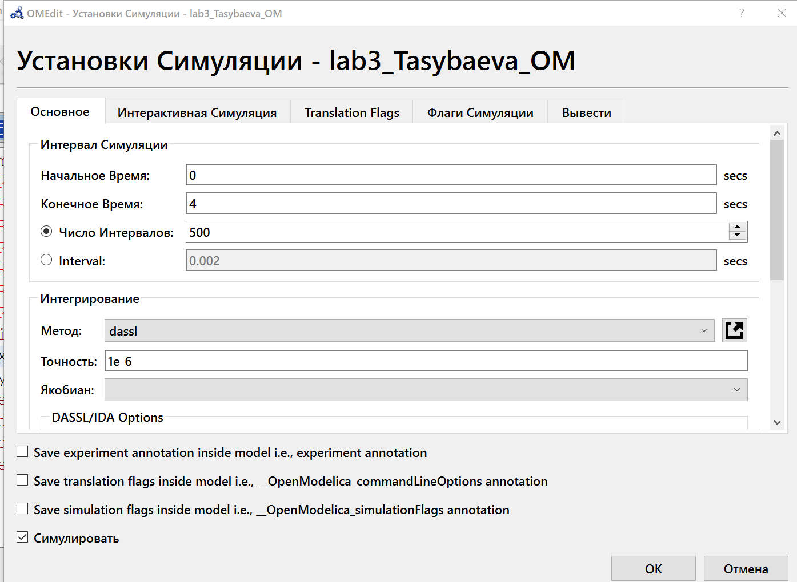
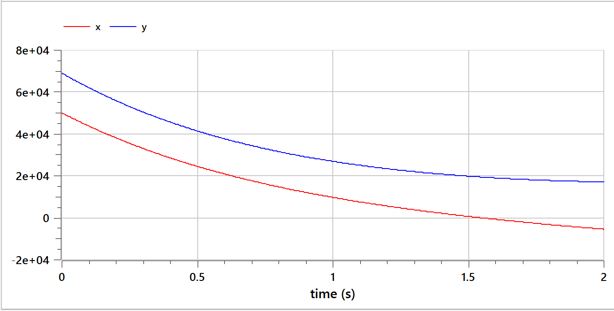
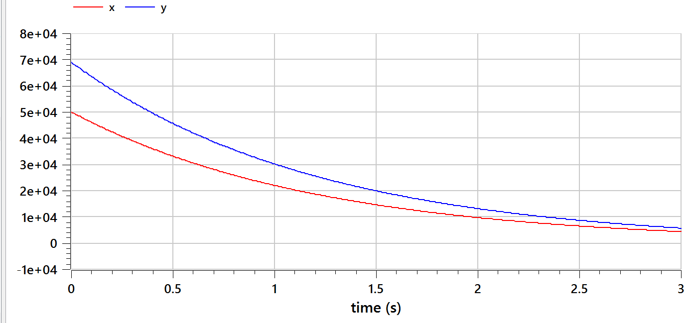
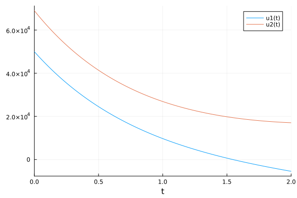
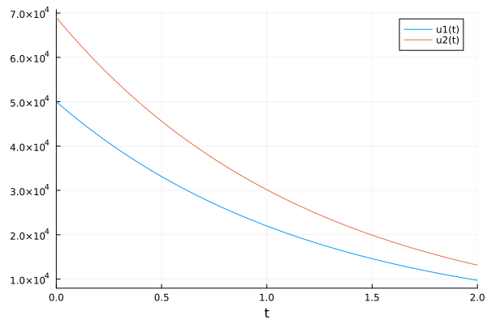

---
## Front matter
title: "Отчёт по лабораторной работе №3"
subtitle: "Модель боевых действий"
author: "Тасыбаева Наталья Сергеевна"

## Generic otions
lang: ru-RU
toc-title: "Содержание"

## Bibliography
bibliography: bib/cite.bib
csl: pandoc/csl/gost-r-7-0-5-2008-numeric.csl

## Pdf output format
toc: true # Table of contents
toc-depth: 2
lof: true # List of figures
lot: true # List of tables
fontsize: 12pt
linestretch: 1.5
papersize: a4
documentclass: scrreprt
## I18n polyglossia
polyglossia-lang:
  name: russian
  options:
	- spelling=modern
	- babelshorthands=true
polyglossia-otherlangs:
  name: english
## I18n babel
babel-lang: russian
babel-otherlangs: english
## Fonts
mainfont: PT Serif
romanfont: PT Serif
sansfont: PT Sans
monofont: PT Mono
mainfontoptions: Ligatures=TeX
romanfontoptions: Ligatures=TeX
sansfontoptions: Ligatures=TeX,Scale=MatchLowercase
monofontoptions: Scale=MatchLowercase,Scale=0.9
## Biblatex
biblatex: true
biblio-style: "gost-numeric"
biblatexoptions:
  - parentracker=true
  - backend=biber
  - hyperref=auto
  - language=auto
  - autolang=other*
  - citestyle=gost-numeric
## Pandoc-crossref LaTeX customization
figureTitle: "Рис."
tableTitle: "Таблица"
listingTitle: "Листинг"
lofTitle: "Список иллюстраций"
lotTitle: "Список таблиц"
lolTitle: "Листинги"
## Misc options
indent: true
header-includes:
  - \usepackage{indentfirst}
  - \usepackage{float} # keep figures where there are in the text
  - \floatplacement{figure}{H} # keep figures where there are in the text
---

# Подготовила
### Тасыбаева Наталья Сергеевна 
### Группа НПИбд-02-20
### Студ. билет 1032201735

# Цель работы

Приведем один из примеров построения математических моделей для выдвижения предположения о будущих результатах юоевых действий. 
Например, рассмотрим некоторые простейшие модели боевых действий – модели
Ланчестера. В противоборстве могут принимать участие как регулярные войска,
так и партизанские отряды. В общем случае главной характеристикой соперников
являются численности сторон. Если в какой-то момент времени одна из
численностей обращается в нуль, то данная сторона считается проигравшей (при
условии, что численность другой стороны в данный момент положительна).

# Задание

## Вариант №6
```
1032201735 mod 70 = 5
5 + 1 = 6
```
С помощью этих вычислений я выявила, что мой вариант - это вариант №6.

## Формулировка задания
```
Между страной Х и страной У идет война. 
Численность состава войск исчисляется от начала войны, и являются временными функциями xt( ) и yt( ). 
В начальный момент времени страна Х имеет армию численностью 50 000 человек, а в распоряжении страны У армия численностью в 69 000 человек. 
Для упрощения модели считаем, что коэффициенты a b c h  постоянны. Также считаем Pt( ) и Q t( ) непрерывные функции.
```
Постройте графики изменения численности войск армии Х и армии У для следующих случаев [@war_theory]:
1. Модель боевых действий между регулярными войсками

du =-0.34x(t)-0.72y(t)+sin(t+10)
  
du =-0.89x(t)-0.43y(t)+cos(t+20)
 
2. Модель ведение боевых действий с участием регулярных войск ипартизанских отрядов 

du=-0.12x(t)-0.51y(t)+sin(20t)

du =-0.3x(t)-0.61y(t)+cos(13t)

# Выполнение лабораторной работы

1. Я начала работу с опенмоделики, так как там значительно проще писать код. [@open-mod]
Для первого случая с моделью боевых действий между регулярными войсками я написала следующий код:
```
model lab3_Tasybaeva_OM
Real x;
Real y;
Real a = 0.34;
Real b = 0.72;
Real c = 0.89;
Real h = 0.43;
Real t = time;
initial equation
x = 50000;
y = 69000;
equation
der(x) = -a*x -b*y +sin(t + 10);
der(y) = -c*x -h*y + cos(t + 20);
end lab3_Tasybaeva_OM;
```
В симуляции я сперва задала время от 0 до 4 (рис. @fig:001), однако увидев на графике, что численность войск X заканчивается примерно в момент 1.5, я переделала время с 0 до 2 (рис. @fig:002).

{#fig:001 width=70%}

{#fig:002 width=70%}

Далее я написала код для второго случая:
```
model lab3_Tasybaeva_OM2
Real x;
Real y;
Real a = 0.12;
Real b = 0.51;
Real c = 0.3;
Real h = 0.61;
Real t = time;
initial equation
x = 50000;
y = 69000;
equation
der(x) = -a*x -b*y +sin(20*t);
der(y) = -c*x -h*y + cos(13*t);
end lab3_Tasybaeva_OM2;
```
В симуляции я задала время от 0 до 3, и получила следующий график(рис. @fig:003).

{#fig:003 width=70%}

2. Далее я написала код на языке Julia. Чтобы вывести графики для двух моделей нужно изменить параметры (для можели без участия партизан параметры закомментированы)
```julia
using Plots
using DifferentialEquations

x0 = 50000
y0 = 69000
#a = 0.34
#b = 0.72
#c = 0.89
#h = 0.43
a = 0.12
b = 0.51
c = 0.3
h = 0.61
t0 = 0
tmax = 2
dt = 100
t = collect(LinRange(t0, tmax, dt))

#function RegularForce(du,u,p,t)
    #du[1] = -a*u[1]-b*u[2]-sin(t+10)
    #du[2] = -c*u[1]-h*u[2]-cos(t+20)
#end
function Partisans(du,u,p,t)
    du[1] = -a* u[1]-b*u[2]-sin(t+10)
    du[2] = -c* u[1]-h*u[2]-cos(t+20)
end

u0 = [x0,y0]
#prob = ODEProblem(RegularForce, u0, (t0, tmax))
prob = ODEProblem(Partisans, u0, (t0, tmax))
sol = solve(prob)

image = plot(sol)
#savefig(image,  "lab3_1.png")
savefig(image, "lab3_2.png")
```

В результате работы программы создались следующие два графика

+ График моделирования боевых действий между регулярными войсками (рис. @fig:004)

{ #fig:004 width=50% height=50% }

+ График моделирования боевых действий между регулярными войсками и партизанами (рис. @fig:005)

{ #fig:005 width=50% height=50% }

# Выводы
Рассмотрели модель боевых действий, провели анализ и вывод дифференциальных уравнений, смоделировали ход боевых действий и выяснили, что войска страны X проигрывают в случае столкновения только регулярных войск и так же в случае столкновения регулярных войск с партизанами.

# Список используемой литературы {.unnumberd}


