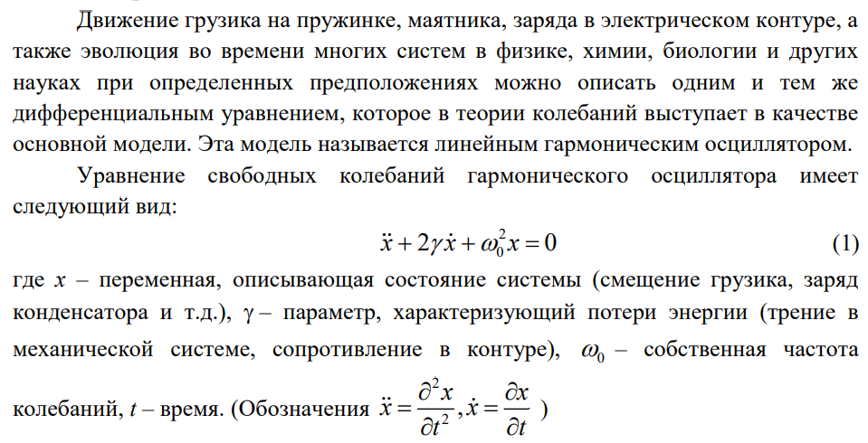

---
## Front matter
lang: ru-RU
title: Презентация лабораторной работы №4
subtitle: Модель гармонических колебаний
author:
  - Тасыбаева Наталья Сергеевна
institute:
  - Российский университет дружбы народов, Москва, Россия
date: 4 марта 2023

## i18n babel
babel-lang: russian
babel-otherlangs: english

## Formatting pdf
toc: false
toc-title: Содержание
slide_level: 2
aspectratio: 169
section-titles: true
theme: metropolis
header-includes:
 - \metroset{progressbar=frametitle,sectionpage=progressbar,numbering=fraction}
 - '\makeatletter'
 - '\beamer@ignorenonframefalse'
 - '\makeatother'
---

# Цели и задачи работы

## Цель лабораторной работы

```
Изучить методы математического моделирования на основе модели линейного гармонического осциллятора.
```
## Теоретический материал 

{ #fig:001 width=50% height=50% }

## Задание к лабораторной работе
```
Постройте фазовый портрет гармонического осциллятора и решение уравнения
гармонического осциллятора для следующих случаев
1. Колебания гармонического осциллятора без затуханий и без действий внешней силы
x'' + 8*x = 0
2. Колебания гармонического осциллятора c затуханием и без действий внешней силы
x'' + 4*x' + 3*x = 0
3. Колебания гармонического осциллятора c затуханием и под действием внешней силы
x'' + 3*x' + 6*x = sin(0.5*t)
На интервале t=[0;45] (шаг 0.05) с начальными условиями x_0 = -1 и y_0 = 0
```

## Результаты
## OpenModelica
В результате работы программы на OpenModelica создались следующие графики

### График решения уравнения гармонического осциллятора для первого уравнения (рис. @fig:002)

{#fig:002 width=70%}

### Фазовый портрет для первого уравнения (рис. @fig:003)

{#fig:003 width=70%}

### График решения уравнения гармонического осциллятора для второго уравнения (рис. @fig:004)

{#fig:004 width=70%}

### Фазовый портрет для второго уравнения (рис. @fig:005)

{#fig:005 width=70%}

### График решения уравнения гармонического осциллятора для третьего уравнения (рис. @fig:006)

{#fig:006 width=70%}

### Фазовый портрет для третьего уравнения (рис. @fig:007)

{#fig:007 width=70%}

## Julia
В результате работы на языке Julia и написания на нём алгоритма решения данных уравнений я получила следующие графики:

### График решения уравнения гармонического осциллятора и фазовый портрет для первого уравнения (рис. @fig:008)

{ #fig:008 width=50% height=50% }

### График решения уравнения гармонического осциллятора и фазовый портрет для второго уравнения (рис. @fig:009)

{ #fig:009 width=50% height=50% }

### График решения уравнения гармонического осциллятора и фазовый портрет для третьего уравнения (рис. @fig:010)

{ #fig:010 width=50% height=50% }

# Выводы по проделанной работе

Рассмотрели модель гармонических колебаний, провели анализ и вывод дифференциальных уравнений, а так жк построили графики зависимости наших переменных от времени и фазовые графики зависимостей.
