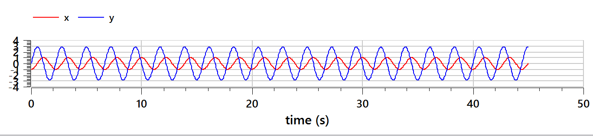
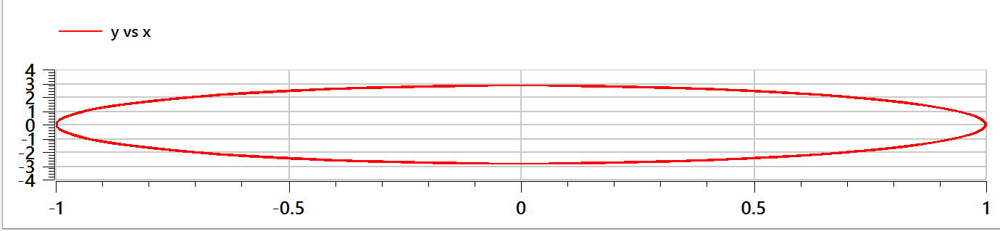
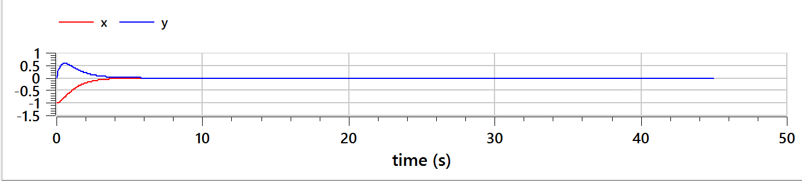
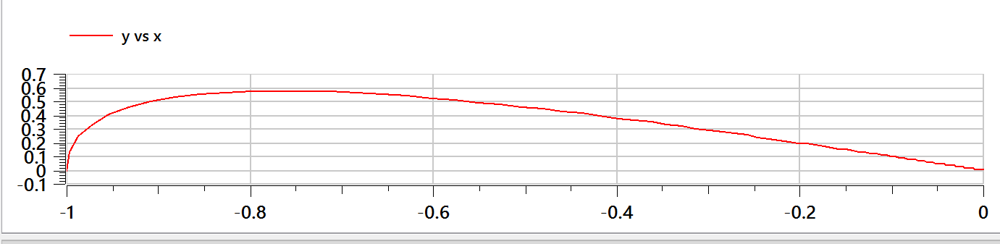
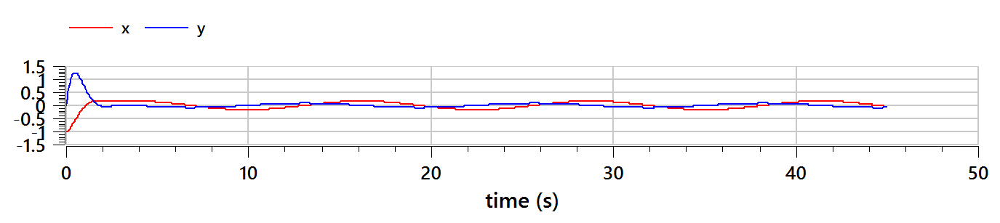
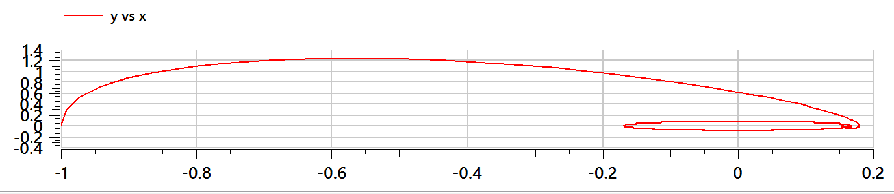
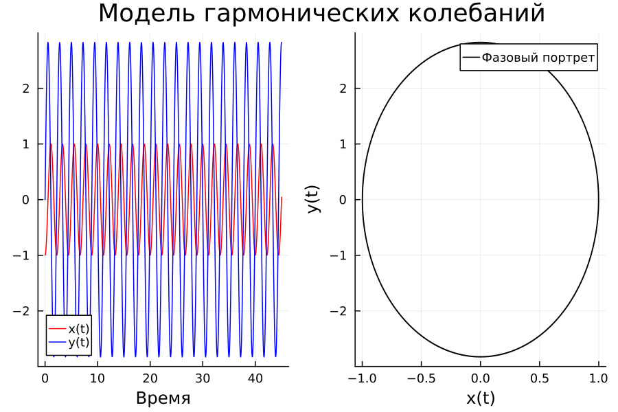
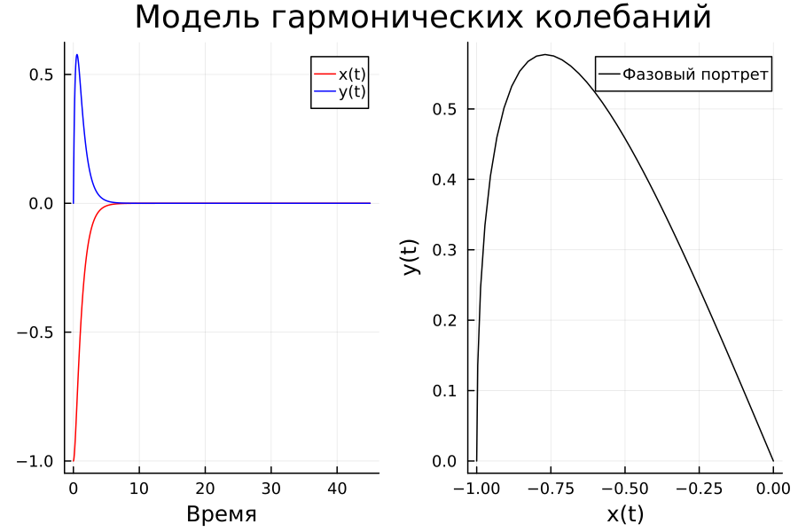

---
## Front matter
title: "Отчёт по лабораторной работе №4"
subtitle: "Модель гармонических колебаний"
author: "Тасыбаева Наталья Сергеевна"

## Generic otions
lang: ru-RU
toc-title: "Содержание"

## Bibliography
bibliography: bib/cite.bib
csl: pandoc/csl/gost-r-7-0-5-2008-numeric.csl

## Pdf output format
toc: true # Table of contents
toc-depth: 2
lof: true # List of figures
lot: true # List of tables
fontsize: 12pt
linestretch: 1.5
papersize: a4
documentclass: scrreprt
## I18n polyglossia
polyglossia-lang:
  name: russian
  options:
	- spelling=modern
	- babelshorthands=true
polyglossia-otherlangs:
  name: english
## I18n babel
babel-lang: russian
babel-otherlangs: english
## Fonts
mainfont: PT Serif
romanfont: PT Serif
sansfont: PT Sans
monofont: PT Mono
mainfontoptions: Ligatures=TeX
romanfontoptions: Ligatures=TeX
sansfontoptions: Ligatures=TeX,Scale=MatchLowercase
monofontoptions: Scale=MatchLowercase,Scale=0.9
## Biblatex
biblatex: true
biblio-style: "gost-numeric"
biblatexoptions:
  - parentracker=true
  - backend=biber
  - hyperref=auto
  - language=auto
  - autolang=other*
  - citestyle=gost-numeric
## Pandoc-crossref LaTeX customization
figureTitle: "Рис."
tableTitle: "Таблица"
listingTitle: "Листинг"
lofTitle: "Список иллюстраций"
lotTitle: "Список таблиц"
lolTitle: "Листинги"
## Misc options
indent: true
header-includes:
  - \usepackage{indentfirst}
  - \usepackage{float} # keep figures where there are in the text
  - \floatplacement{figure}{H} # keep figures where there are in the text
---

# Подготовила
### Тасыбаева Наталья Сергеевна 
### Группа НПИбд-02-20
### Студ. билет 1032201735

# Цель работы

Изучить методы математического моделирования на основе модели линейного гармонического осциллятора.

# Теоретическое введение
Движение грузика на пружинке, маятника, заряда в электрическом контуре, а
также эволюция во времени многих систем в физике, химии, биологии и других
науках при определенных предположениях можно описать одним и тем же
дифференциальным уравнением, которое в теории колебаний выступает в качестве
основной модели. Эта модель называется линейным гармоническим осциллятором.

# Задание

## Вариант №6
```
1032201735 mod 70 = 5
5 + 1 = 6
```
С помощью этих вычислений я выявила, что мой вариант - это вариант №6.

## Формулировка задания
```
Постройте фазовый портрет гармонического осциллятора и решение уравнения
гармонического осциллятора для следующих случаев
1. Колебания гармонического осциллятора без затуханий и без действий внешней силы
x'' + 8*x = 0
2. Колебания гармонического осциллятора c затуханием и без действий внешней силы
x'' + 4*x' + 3*x = 0
3. Колебания гармонического осциллятора c затуханием и под действием внешней силы
x'' + 3*x' + 6*x = sin(0.5*t)
На интервале t=[0;45] (шаг 0.05) с начальными условиями x_0 = -1 и y_0 = 0
```

# Выполнение лабораторной работы

1. Я начала работу с опенмоделики, так как там значительно проще писать код и он быстрее работает. [@open-mod]
Для первого случая я написала следующий код:
```
model lab4_OM
Real x;
Real y;
Real a = 8;
Real t = time;
initial equation
x = -1;
y = 0;
equation
der(x) = y;
der(y) = -a*x;
end lab4_OM;
```
В симуляции я сперва получила стандартный график зависимости X и Y от времени (рис. @fig:001), и так же фазовый график зависимоти X от Y (рис. @fig:002).

{#fig:001 width=70%}

{#fig:002 width=70%}

Далее я написала код для второго случая:
```
model lab4_OM
Real x;
Real y;
Real a = 3;
Real b = 4;
Real t = time;
initial equation
x = -1;
y = 0;
equation
der(x) = y;
der(y) = -a*x - b*y;
end lab4_OM;
```
В результате я так же получила два графика: зависимость от времени (рис. @fig:003) и фазовый график (рис. @fig:004).

{#fig:003 width=70%}
{#fig:004 width=70%}

Для третьего уравнения я написала следующий код
```
model lab4_OM
Real x;
Real y;
Real a = 6;
Real b = 3;
Real t = time;
initial equation
x = -1;
y = 0;
equation
der(x) = y;
der(y) = -a*x - b*y + sin(0.5*t);
end lab4_OM;
```
В результате работы программы я получила так же два графика: зависимость от времени (рис. @fig:005) и фазовый график (рис. @fig:006).

{#fig:005 width=70%}
{#fig:006 width=70%}

2. Далее я написала код на языке Julia. Код программы для всех трёх уравнений будет идентичен, за исключением того, что нужно будет изменить значения параметров omega_square и gamma, а так же в уравнение для третьей программы добавить синус. Далее представлена версия кода для третьей программы.
```julia
using Plots
using DifferentialEquations
println("super")
omega_square = 6
gamma = 3
t_min = 0
t_max = 45
T = (t_min, t_max)
x0 = -1
y0 = 0
u0 = [x0,y0]

function Function(du,u,p,t)
    du[1] = u[2]
    du[2] = -omega_square*u[1] - gamma*u[2] + sin(0.5*t)
end

prob = ODEProblem(Function, u0, T)
sol = solve(prob, saveat = 0.05, abstol = 1e-8, reltol = 1e-8)

X = []
Y = []
for u in sol.u
    x, y = u
    push!(X, x)
    push!(Y, y)
end


Time = sol.t 

plt = plot(dpi = 150, layout = (1,2), plot_title = "Модель гармонических колебаний")
plot!(plt[1], Time, [X, Y], color=[ :red :blue], xlabel= "Время", label = ["x(t)" "y(t)"])
plot!(plt[2], X, Y, color = [:black], xlabel="x(t)", ylabel="y(t)", label="Фазовый портрет")
savefig(plt, "lab4_3.png")
```

В результате работы программы создались следующие графики:

- График зависимости X и Y от времени и фазовый график для первого уравнения (рис. @fig:007)

{ #fig:007 width=50% height=50% }

- График зависимости X и Y от времени и фазовый график для второго уравнения (рис. @fig:008)

{ #fig:008 width=50% height=50% }

- График зависимости X и Y от времени и фазовый график для третьего уравнения (рис. @fig:009)

{ #fig:008 width=50% height=50% }

# Выводы
Рассмотрели модель гармонических колебаний, провели анализ и вывод дифференциальных уравнений, а так жк построили графики зависимости наших переменных от времени и фазовые графики зависимостей.

# Список используемой литературы {.unnumberd}


