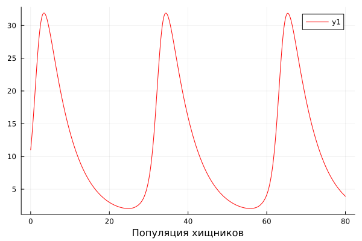
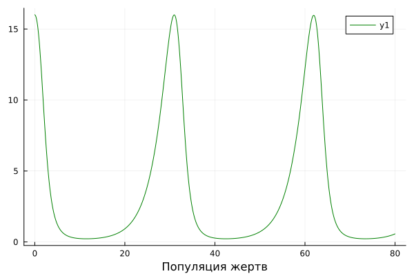
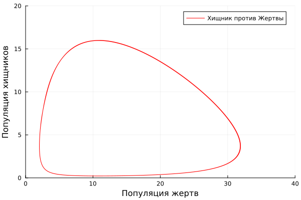
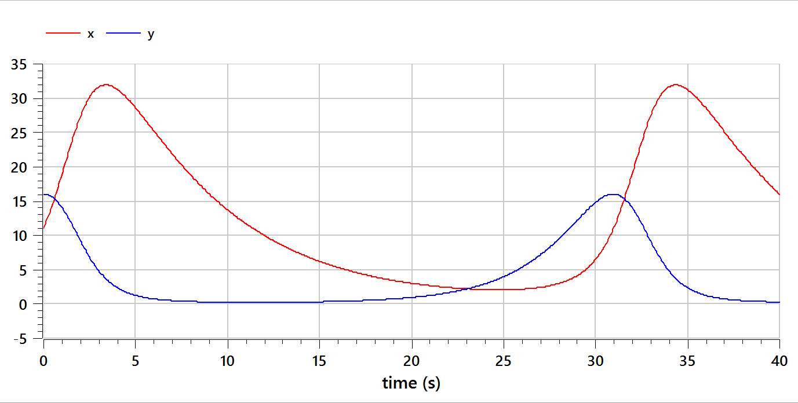
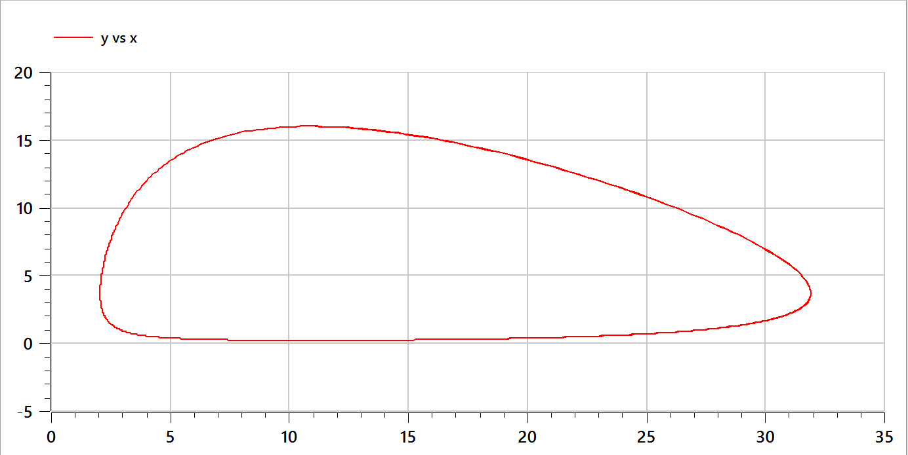

---
## Front matter
lang: ru-RU
title: Презентация лабораторной работы №5
subtitle: Модель Хищник-Жертва
author:
  - Тасыбаева Наталья Сергеевна
institute:
  - Российский университет дружбы народов, Москва, Россия
date: 11 марта 2023

## i18n babel
babel-lang: russian
babel-otherlangs: english

## Formatting pdf
toc: false
toc-title: Содержание
slide_level: 2
aspectratio: 169
section-titles: true
theme: metropolis
mainfont: PT Serif
romanfont: PT Serif
sansfont: PT Sans
monofont: PT Mono
header-includes:
 - \metroset{progressbar=frametitle,sectionpage=progressbar,numbering=fraction}
 - '\makeatletter'
 - '\beamer@ignorenonframefalse'
 - '\makeatother'
---

# Цели и задачи работы

## Цель лабораторной работы

Изучить модель Хищник-Жертва

## Задание к лабораторной работе

1.	Построить графика колебаний изменения числа популяции хищников и жертв.
2.	Построить график зависимости изменения численности хищников от изменения численности жертв
3.	Найти стационарное состояние системы.

## Условие задачи

Для модели «хищник-жертва»:

$$
 \begin{cases}
	\frac{dx}{dt}= -0.17x(t) + 0.046x(t)y(t) 
	\\   
	\frac{dy}{dt}= 0.37y(t) - 0.034x(t)y(t) 
 \end{cases}
$$

Постройте график зависимости численности хищников от численности жертв,
а также графики изменения численности хищников и численности жертв при
следующих начальных условиях: $x_0=11$ и $y_0=16$. Найдите стационарное
состояние системы.

# Процесс выполнения лабораторной работы

## Теоретический материал

Простейшая модель взаимодействия двух видов типа «хищник — жертва» -
модель Лотки-Вольтерры. Данная двувидовая модель основывается на
следующих предположениях:

1. Численность популяции жертв x и хищников y зависят только от времени
(модель не учитывает пространственное распределение популяции на
занимаемой территории)
2. В отсутствии взаимодействия численность видов изменяется по модели
Мальтуса, при этом число жертв увеличивается, а число хищников падает
3. Естественная смертность жертвы и естественная рождаемость хищника
считаются несущественными
4. Эффект насыщения численности обеих популяций не учитывается
5. Скорость роста численности жертв уменьшается пропорционально
численности хищников

## Теоретический материал

$$
 \begin{cases}
	\frac{dx}{dt}= -ax(t) + bx(t)y(t) 
	\\   
	\frac{dy}{dt}= cy(t) - dx(t)y(t) 
 \end{cases}
$$

- $x$ – число жертв;
- $y$ - число хищников;
- $a$ - скорость естественного прироста числа жертв в отсутствие хищников;
- $b$ - естественный прирост жертв;
- $с$ - естественное вымирание хищников, лишенных пищи в виде жертв;
- $d$ - коэффициент смертности жертв;ъ
 
Стационарное состояние системы (положение равновесия, не зависящее
от времени решение) будет в точке: $x_{0} = \frac{c}{d}$, $y_{0} = \frac{a}{b}$ . 

## Расчет стационарного состояния системы

В нашем случае стационарная точки равняются:

$x_{0} = \frac{c}{d} = \frac{0,37}{0,034} = 10,88$

$y_{0} = \frac{a}{b} = \frac{0,17}{0,046} = 3,69$

## График колебания численности хищников на Julia

{ #fig:001 width=60% height=60% }

## График колебания численности жертв на Julia

{ #fig:002 width=60% height=60% }

## График зависимости численности хищников от численности жертв на Julia

{ #fig:003 width=60% height=60% }

## График колебания численности жертв и хищников на OpenModelica

{ #fig:004 width=60% height=60% }

## График зависимости численности хищников от численности жертв на OpenModelica

{ #fig:005 width=60% height=60% }

# Выводы по проделанной работе

В ходе выполнения лабораторной работы была изучена модель Хищник-Жертва и были построены графики колебания численности их популяций и зависимости количества хищников от жертв.
