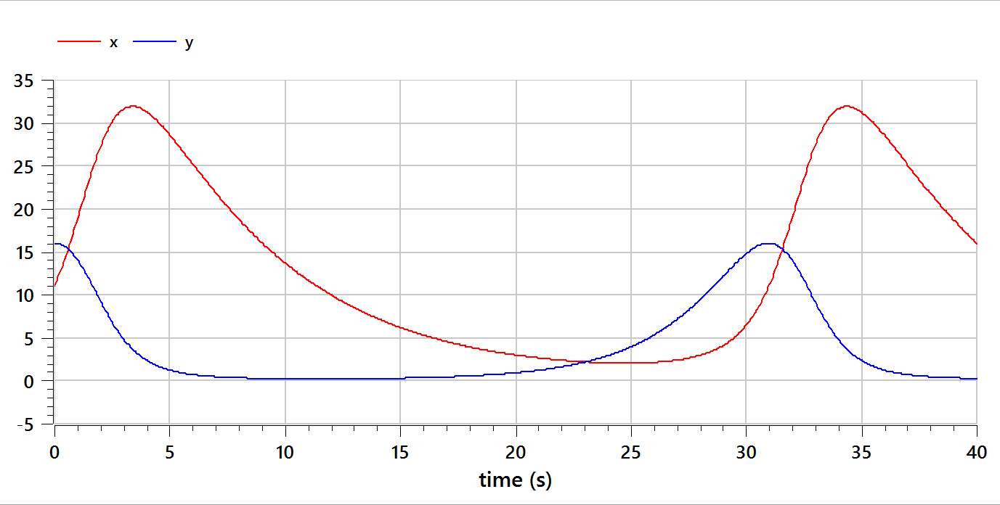
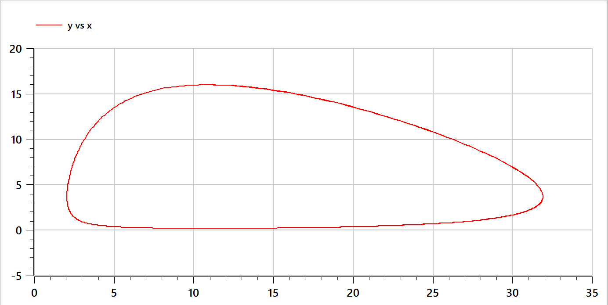
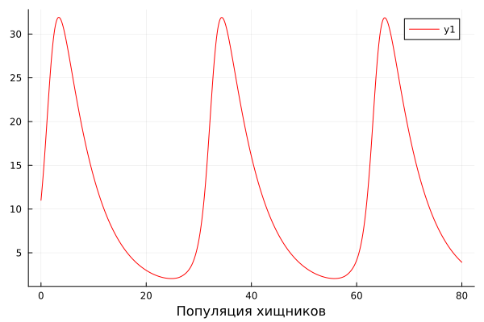
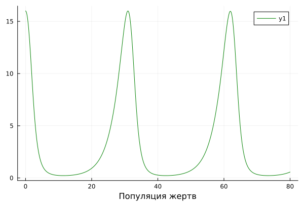
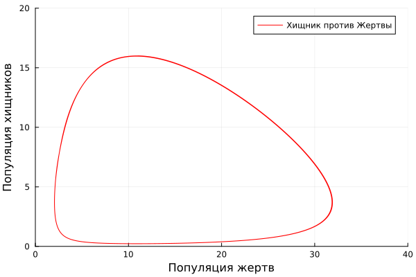

---
## Front matter
title: "Отчёт по лабораторной работе №5"
subtitle: "Модель Хищник-Жертва"
author: "Тасыбаева Н.С."

## Generic otions
lang: ru-RU
toc-title: "Содержание"

## Bibliography
bibliography: bib/cite.bib
csl: pandoc/csl/gost-r-7-0-5-2008-numeric.csl

## Pdf output format
toc: true # Table of contents
toc-depth: 2
lof: true # List of figures
lot: true # List of tables
fontsize: 12pt
linestretch: 1.5
papersize: a4
documentclass: scrreprt
## I18n polyglossia
polyglossia-lang:
  name: russian
  options:
	- spelling=modern
	- babelshorthands=true
polyglossia-otherlangs:
  name: english
## I18n babel
babel-lang: russian
babel-otherlangs: english
## Fonts
mainfont: PT Serif
romanfont: PT Serif
sansfont: PT Sans
monofont: PT Mono
mainfontoptions: Ligatures=TeX
romanfontoptions: Ligatures=TeX
sansfontoptions: Ligatures=TeX,Scale=MatchLowercase
monofontoptions: Scale=MatchLowercase,Scale=0.9
## Biblatex
biblatex: true
biblio-style: "gost-numeric"
biblatexoptions:
  - parentracker=true
  - backend=biber
  - hyperref=auto
  - language=auto
  - autolang=other*
  - citestyle=gost-numeric
## Pandoc-crossref LaTeX customization
figureTitle: "Рис."
tableTitle: "Таблица"
listingTitle: "Листинг"
lofTitle: "Список иллюстраций"
lotTitle: "Список таблиц"
lolTitle: "Листинги"
## Misc options
indent: true
header-includes:
  - \usepackage{indentfirst}
  - \usepackage{float} # keep figures where there are in the text
  - \floatplacement{figure}{H} # keep figures where there are in the text
---

# Подготовила

* Тасыбаева Наталья Сергеевна

* Группа НПИбд-02-20

* Студ. билет 1032201735

# Цель работы

Изучить модель "Хищник-Жертва" и построить графики функций.

# Задание

Вариант №6

Для модели «хищник-жертва»:

$$
 \begin{cases}
	\frac{dx}{dt}= -0.17x(t) + 0.046x(t)y(t) 
	\\   
	\frac{dy}{dt}= 0.37y(t) - 0.034x(t)y(t) 
 \end{cases}
$$

Постройте график зависимости численности хищников от численности жертв,
а также графики изменения численности хищников и численности жертв при
следующих начальных условиях: $x_0=11$ и $y_0=16$. Найдите стационарное
состояние системы.
# Теоретическое введение

Простейшая модель взаимодействия двух видов типа «хищник — жертва» -
модель Лотки-Вольтерры [@esystem-lab5]. Данная двувидовая модель основывается на
следующих предположениях:

1. Численность популяции жертв x и хищников y зависят только от времени
(модель не учитывает пространственное распределение популяции на
занимаемой территории)
2. В отсутствии взаимодействия численность видов изменяется по модели
Мальтуса, при этом число жертв увеличивается, а число хищников падает
3. Естественная смертность жертвы и естественная рождаемость хищника
считаются несущественными
4. Эффект насыщения численности обеих популяций не учитывается
5. Скорость роста численности жертв уменьшается пропорционально
численности хищников

$$
 \begin{cases}
	\frac{dx}{dt}= -ax(t) + bx(t)y(t) 
	\\   
	\frac{dy}{dt}= cy(t) - dx(t)y(t) 
 \end{cases}
$$

В этой модели $x$ – число жертв, $y$ - число хищников. Коэффициент $a$
описывает скорость естественного прироста числа жертв в отсутствие хищников, $с$ — 
естественное вымирание хищников, лишенных пищи в виде жертв. Вероятность
взаимодействия жертвы и хищника считается пропорциональной как количеству
жертв, так и числу самих хищников ($xy$). Каждый акт взаимодействия уменьшает
популяцию жертв, но способствует увеличению популяции хищников (члены $-bxy$
и $dxy$ в правой части уравнения). Стационарное состояние системы (положение равновесия, не зависящее
от времени решение) будет в точке: $x_{0} = \frac{c}{d}$, $y_{0} = \frac{a}{b}$ . 

# Выполнение лабораторной работы

## Расчет стационарного состояния системы

$x_{0} = \frac{c}{d} = \frac{0,37}{0,034} = 10,88$

$y_{0} = \frac{a}{b} = \frac{0,17}{0,046} = 3,69$

## Решение на OpenModelica

Сперва я написала код на OpenModelica [@openmodelicaODE] и построила два графика: 
- График зависимости численности популяций хищников и жертв от времени
- График зависимости численности хищников от численности жертв

```
model lab5_Tasybaeva
Real x;
Real y;
Real a = 0.17;
Real b = 0.046;
Real c = 0.37;
Real d = 0.034;
Real t = time;
initial equation
x = 11;
y = 16;
equation
der(x) = -a*x + b*x*y;
der(y) = c*y - d*x*y;
end lab5_Tasybaeva;
```

## Результаты, получение с помощью OpenModelica

График колебания изменения численности хищников и численности жертв (рис. @fig:001).

{#fig:001 width=70%}

График зависимости изменения численности хищников от изменения численности жертв (рис. @fig:002).

{#fig:002 width=70%}

## Решение на языке julia
Далее я реализовала алгоритм на языке Julia [@juliaODE].

```julia
using Plots
using DifferentialEquations
# вариант 6
a = 0.17
b = 0.046
c = 0.37
d = 0.034
function system(dx, x, p, t)
  dx[1] = -a*x[1] + b*x[1]*x[2]
  dx[2] = c*x[2] - d*x[1]*x[2]
end
t0 = 0
tmax=80
T=(t0, tmax)
x0 = [11, 16] 
t = collect(LinRange(t0, tmax, 8000)) 
prob = ODEProblem(system, x0, T)
sol = solve(prob, saveat=t)
y1 = [sol[i][1] for i in 1:length(sol)]
y2 = [sol[i][2] for i in 1:length(sol)]
plot(  
	t, 
	y1, 
	xlabel="Популяция хищников",  
	color=:red)
savefig("lab5_1.png")
plot( 
	t, 
	y2,  
	xlabel="Популяция жертв",  
	color=:green
)
savefig("lab5_2.png")
plot(
	y1, 
    y2, 
	xlabel="Популяция жертв", 
	ylabel="Популяция хищников", 
	label="Хищник против Жертвы", 
	color=:red, 
	xlim=[0,40], 
	ylim=[0,20]
) 
savefig("lab5_3.png")
```
## Результаты, получение с помощью julia

График колебания изменения численности хищников (рис. @fig:003).

{#fig:003 width=70%}

График колебания изменения численности жертв (рис. @fig:004).

{#fig:004 width=70%}

График зависимости изменения численности хищников от изменения численности жертв (рис. @fig:005).

{#fig:005 width=70%}

# Выводы

Я изучила можель «хищник-жертва» и построила график зависимости количества хищников от количества жертв, а также график колебаний изменений популяций хищников и популяций жертв в зависимости от времени.

# Список используемой литературы {.unnumberd}
