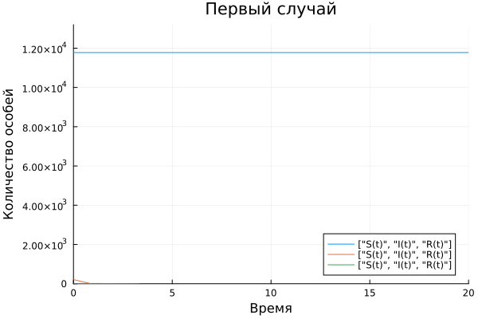
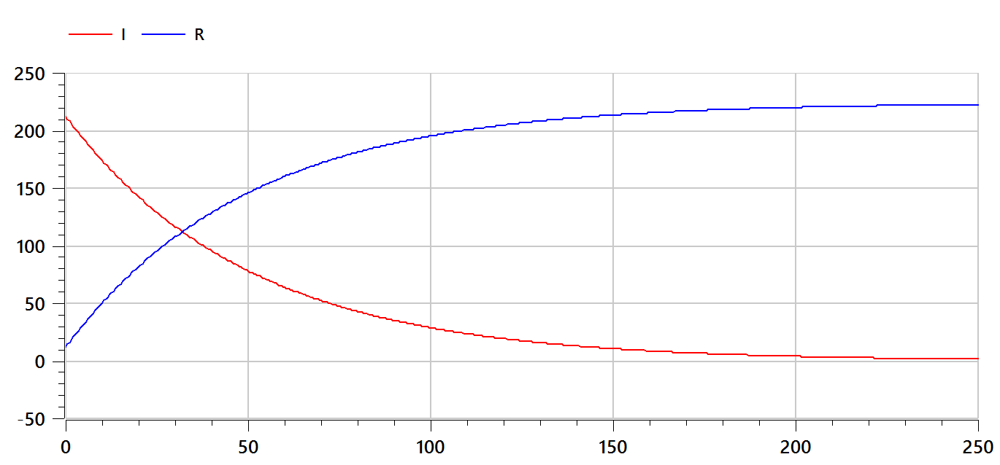

---
## Front matter
lang: ru-RU
title: Презентация лабораторной работы №6
subtitle: Задача об эпидемии
author:
  - Тасыбаева Наталья Сергеевна
institute:
  - Российский университет дружбы народов, Москва, Россия
date: 18 марта 2023

## i18n babel
babel-lang: russian
babel-otherlangs: english

## Formatting pdf
toc: false
toc-title: Содержание
slide_level: 2
aspectratio: 169
section-titles: true
theme: metropolis
mainfont: PT Serif
romanfont: PT Serif
sansfont: PT Sans
monofont: PT Mono
header-includes:
 - \metroset{progressbar=frametitle,sectionpage=progressbar,numbering=fraction}
 - '\makeatletter'
 - '\beamer@ignorenonframefalse'
 - '\makeatother'
---

# Цели и задачи работы

## Цель лабораторной работы

Решить задачу об эпидемии

## Задание к лабораторной работе

1.	Построить графики протекания эпидемии при случае $I(t)>I*$
2.	Построить графики протекания эпидемии при случае $I(t)\le I*$

## Условие задачи

На одном острове вспыхнула эпидемия. Известно, что из всех проживающих
на острове (N=12000) в момент начала эпидемии (t=0) число заболевших людей
(являющихся распространителями инфекции) I(0)=212, А число здоровых людей с
иммунитетом к болезни R(0)=12. Таким образом, число людей восприимчивых к
болезни, но пока здоровых, в начальный момент времени S(0)=N-I(0)-R(0).
Постройте графики изменения числа особей в каждой из трех групп.  
  Рассмотрите, как будет протекать эпидемия в случае:  
  1) $I(t)\le I*$  
  2) $I(t)>I*$ 

# Процесс выполнения лабораторной работы

## Теоретический материал

Предположим, что некая популяция, состоящая из N особей, (считаем, что популяция изолирована)
подразделяется на три группы. Первая группа - это восприимчивые к болезни, но
пока здоровые особи, обозначим их через S(t). Вторая группа – это число
инфицированных особей, которые также при этом являются распространителями
инфекции, обозначим их I(t). А третья группа, обозначающаяся через R(t) – это
здоровые особи с иммунитетом к болезни.  
  До того, как число заболевших не превышает критического значения
I*, считаем, что все больные изолированы и не заражают здоровых. Когда I(t) > I*,
тогда инфицирование способны заражать восприимчивых к болезни особей.  
  Таким образом, скорость изменения числа S(t) меняется по следующему
закону: 
$\frac{dS}{dt} = -aS, если I(t) > I*$ и $\frac{dS}{dt} = 0, если I(t) \le I*$

## Теоретический материал

Поскольку каждая восприимчивая к болезни особь, которая, в конце концов,
заболевает, сама становится инфекционной, то скорость изменения числа
инфекционных особей представляет разность за единицу времени между
заразившимися и теми, кто уже болеет и лечится, т.е.: 
$\frac{dI}{dt} = aS - bI, если I(t) > I*$ и $\frac{dS}{dt} = -bI, если I(t) \le I*$  
  А скорость изменения выздоравливающих особей (при этом приобретающие
иммунитет к болезни): $\frac{dR}{dt} = bI$

## Теоретический материал

Постоянные пропорциональности a, b — это коэффициенты заболеваемости
и выздоровления соответственно.  
  Для того, чтобы решения соответствующих уравнений определялось
однозначно, необходимо задать начальные условия. Считаем, что на начало
эпидемии в момент времени t = 0 нет особей с иммунитетом к болезни R(0)=0, а
число инфицированных и восприимчивых к болезни особей I(0) и S(0) соответственно.
Для анализа картины протекания эпидемии необходимо
рассмотреть два случая: $I(t)\le I*$ и $I(0)>I*$.

## График для второго случая на Julia

{ #fig:001 width=60% height=60% }

## График для второго случая на Julia

{ #fig:002 width=60% height=60% }

## График для первого случая на OpenModelica

{ #fig:003 width=60% height=60% }

## График для второго случая эпидемии на OpenModelica

{ #fig:004 width=60% height=60% }

# Выводы по проделанной работе

В ходе выполнения лабораторной работы была изучена модель Эпидемии и были построены графики её протекания в 2 случаях.
