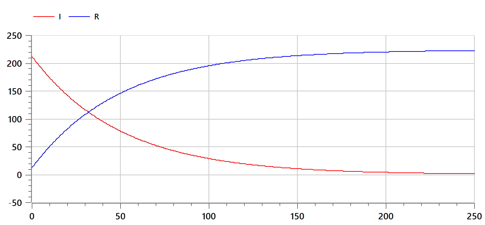
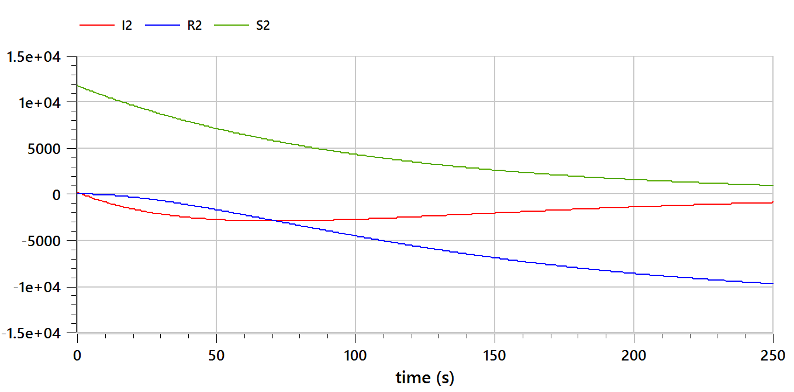
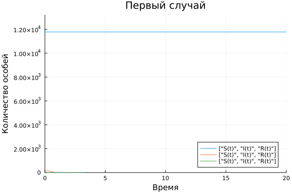
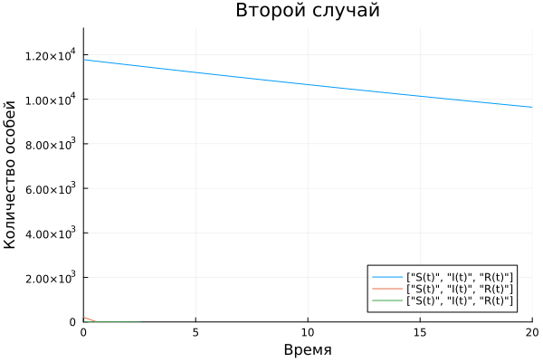

---
## Front matter
title: "Отчёт по лабораторной работе №6"
subtitle: "Задача об эпидемии"
author: "Тасыбаева Н.С."

## Generic otions
lang: ru-RU
toc-title: "Содержание"

## Bibliography
bibliography: bib/cite.bib
csl: pandoc/csl/gost-r-7-0-5-2008-numeric.csl

## Pdf output format
toc: true # Table of contents
toc-depth: 2
lof: true # List of figures
lot: true # List of tables
fontsize: 12pt
linestretch: 1.5
papersize: a4
documentclass: scrreprt
## I18n polyglossia
polyglossia-lang:
  name: russian
  options:
	- spelling=modern
	- babelshorthands=true
polyglossia-otherlangs:
  name: english
## I18n babel
babel-lang: russian
babel-otherlangs: english
## Fonts
mainfont: PT Serif
romanfont: PT Serif
sansfont: PT Sans
monofont: PT Mono
mainfontoptions: Ligatures=TeX
romanfontoptions: Ligatures=TeX
sansfontoptions: Ligatures=TeX,Scale=MatchLowercase
monofontoptions: Scale=MatchLowercase,Scale=0.9
## Biblatex
biblatex: true
biblio-style: "gost-numeric"
biblatexoptions:
  - parentracker=true
  - backend=biber
  - hyperref=auto
  - language=auto
  - autolang=other*
  - citestyle=gost-numeric
## Pandoc-crossref LaTeX customization
figureTitle: "Рис."
tableTitle: "Таблица"
listingTitle: "Листинг"
lofTitle: "Список иллюстраций"
lotTitle: "Список таблиц"
lolTitle: "Листинги"
## Misc options
indent: true
header-includes:
  - \usepackage{indentfirst}
  - \usepackage{float} # keep figures where there are in the text
  - \floatplacement{figure}{H} # keep figures where there are in the text
---

# Подготовила

* Тасыбаева Наталья Сергеевна

* Группа НПИбд-02-20

* Студ. билет 1032201735

# Цель работы

Решить задачу об эпидемии

# Задание

Вариант №6

На одном острове вспыхнула эпидемия. Известно, что из всех проживающих
на острове (N=12000) в момент начала эпидемии (t=0) число заболевших людей
(являющихся распространителями инфекции) I(0)=212, А число здоровых людей с
иммунитетом к болезни R(0)=12. Таким образом, число людей восприимчивых к
болезни, но пока здоровых, в начальный момент времени S(0)=N-I(0)-R(0).
Постройте графики изменения числа особей в каждой из трех групп.  
  Рассмотрите, как будет протекать эпидемия в случае:  
  1) если I(0)<=I*  
  2) если I(0)>I*
# Теоретическое введение

Предположим, что некая популяция, состоящая из N особей, (считаем, что популяция изолирована) подразделяется на три группы. Первая группа - это восприимчивые к болезни, но пока здоровые особи, обозначим их через S(t). Вторая группа – это число инфицированных особей, которые также при этом являются распространителями инфекции, обозначим их I(t). А третья группа, обозначающаяся через R(t) – это здоровые особи с иммунитетом к болезни.  
До того, как число заболевших не превышает критического значения I*, считаем, что все больные изолированы и не заражают здоровых. Когда I(t) > I*, тогда инфицирование способны заражать восприимчивых к болезни особей.  
Таким образом, скорость изменения числа S(t) меняется по следующему закону: 
$\frac{dS}{dt} = -aS, если I(t) > I*$ и $\frac{dS}{dt} = 0, если I(t) <= I*$

Поскольку каждая восприимчивая к болезни особь, которая, в конце концов, заболевает, сама становится инфекционной, то скорость изменения числа инфекционных особей представляет разность за единицу времени между заразившимися и теми, кто уже болеет и лечится, т.е.: 
$\frac{dI}{dt} = aS - bI, если I(t) > I*$ и $\frac{dS}{dt} = -bI, если I(t) <= I*$  
А скорость изменения выздоравливающих особей (при этом приобретающие иммунитет к болезни): $\frac{dR}{dt} = bI$

Постоянные пропорциональности a, b — это коэффициенты заболеваемости
и выздоровления соответственно.  
Для того, чтобы решения соответствующих уравнений определялось однозначно, необходимо задать начальные условия. Считаем, что на начало эпидемии в момент времени t = 0 нет особей с иммунитетом к болезни R(0)=0, а число инфицированных и восприимчивых к болезни особей I(0) и S(0) соответственно. Для анализа картины протекания эпидемии необходимо рассмотреть два случая: I(0)<=I* и I(0)>I*.
[@esystem-lab5]
# Выполнение лабораторной работы

## Решение на OpenModelica

Сперва я написала код на OpenModelica [@openmodelicaODE] и построила графики для первого и второго случая:

- Код для первого случая

```
model lab6_Tasybaeva
parameter Real N = 12000;
parameter Real I_0 = 212;
parameter Real R_0 = 12;
parameter Real S_0=N-I_0-R_0;
parameter Real alpha = 0.01;
parameter Real beta = 0.02;

Real S(start=S_0);
Real I(start=I_0);
Real R(start=R_0);

equation
der(S)=0;
der(I)=-beta*I;
der(R)=beta*I;
end lab6_Tasybaeva;
```
- Код для второго случая
```
model lab6_Tasybaeva
parameter Real N = 12000;
parameter Real I_0 = 212;
parameter Real R_0 = 12;
parameter Real S_0=N-I_0-R_0;
parameter Real alpha = 0.01;
parameter Real beta = 0.02;

Real S2(start=S_0);
Real I2(start=I_0);
Real R2(start=R_0);

equation
der(S2)=-alpha*S2;
der(I2)=-alpha*S2-beta*I2;
der(R2)=beta*I2;
end lab6_Tasybaeva;
```
## Результаты, получение с помощью OpenModelica

График для первого случая, если I(0)<=I* (рис. @fig:001).

{#fig:001 width=70%}

График для второго случая, если I(0)>I* (рис. @fig:002).

{#fig:002 width=70%}

## Решение на языке julia
Далее я реализовала алгоритм на языке Julia [@juliaODE].

```julia
using Plots
using DifferentialEquations
# вариант 6
const N = 12000
const I0 = 212
const R0 = 12
const S0 = N-I0-R0

alpha = 0.01
beta = 0.02

#первый случай
function Function1(dx,x,p,t)
    dx[1]=0
    dx[2]=-beta*x[1]
    dx[3]=beta*x[2]
end

#второй случай
function Function2(dx,x,p,t)
    dx[1]=-alpha*x[1]
    dx[2]=-alpha*x[1]-beta*x[1]
    dx[3]=beta*x[2]
end

t0 = 0.0
tmax=20.0
T=(t0, tmax)
t = range(T[1], T[2], step=0.01)
x0=[S0,I0,R0]

prob = ODEProblem(Function1, x0, T)
sol = solve(prob, saveat=t)

plot(sol, label=["S(t)","I(t)","R(t)"], ylim=[0,1.1*N])
plot!(title="Первый случай", xlabel="Время", ylabel="Количество особей")
savefig("lab6_1.png")

prob = ODEProblem(Function2, x0, T)
sol = solve(prob, saveat=t)

plot(sol, label=["S(t)","I(t)","R(t)"], ylim=[0,1.1*N])
plot!(title="Второй случай", xlabel="Время", ylabel="Количество особей")
savefig("lab6_2.png")
```
## Результаты, получение с помощью julia

График для первого случая на Julia (рис. @fig:003).

{#fig:003 width=70%}

График для второго случая на Julia (рис. @fig:004).

{#fig:004 width=70%}


# Выводы

Я изучила модель эпидемии.

# Список используемой литературы {.unnumberd}
