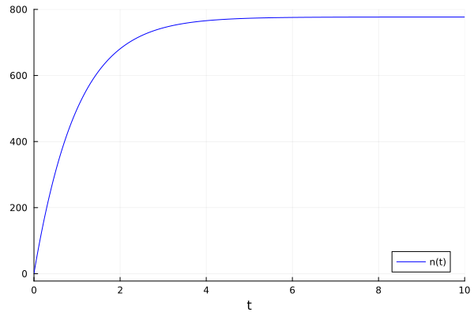
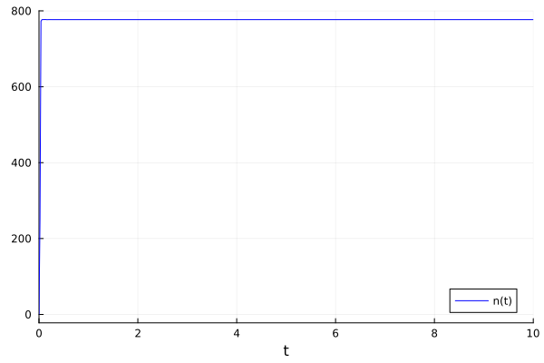
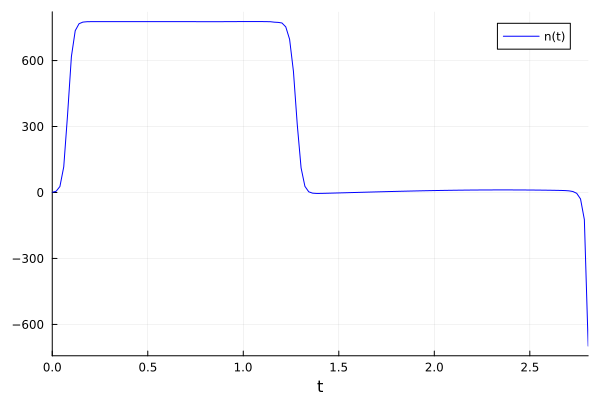
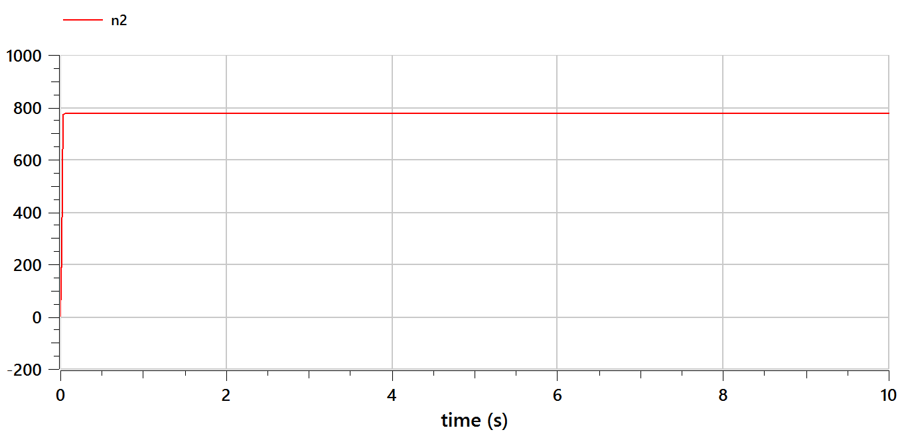
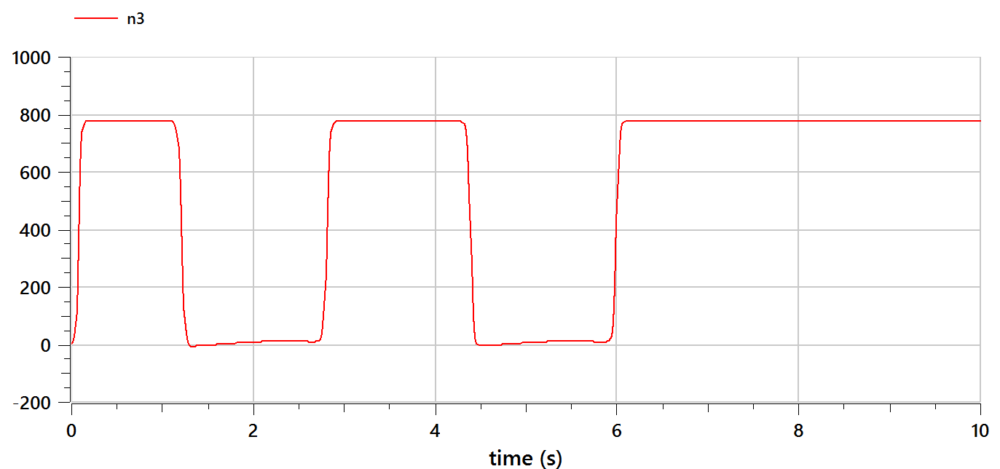

---
## Front matter
lang: ru-RU
title: Презентация лабораторной работы №7
subtitle: Эффективность рекламы
author:
  - Тасыбаева Наталья Сергеевна
institute:
  - Российский университет дружбы народов, Москва, Россия
date: 24 марта 2023

## i18n babel
babel-lang: russian
babel-otherlangs: english

## Formatting pdf
toc: false
toc-title: Содержание
slide_level: 2
aspectratio: 169
section-titles: true
theme: metropolis
mainfont: PT Serif
romanfont: PT Serif
sansfont: PT Sans
monofont: PT Mono
header-includes:
 - \metroset{progressbar=frametitle,sectionpage=progressbar,numbering=fraction}
 - '\makeatletter'
 - '\beamer@ignorenonframefalse'
 - '\makeatother'
---

# Цели и задачи работы

## Цель лабораторной работы

Построить графики эффективности рекламы.

## Задание к лабораторной работе

1.	Изучить модель эфеективности рекламы
2.	Построить графики распространения рекламы в 3 случаях
3.	Определить для случая 2 момент времени, в который скорость распространения рекламы будет максимальной

## Условие задачи

Постройте график распространения рекламы, математическая модель которой описывается
следующим уравнением:

$\frac{dn}{dt}= (0.99 + 0.00012n(t))*(N-n(t))$

$\frac{dn}{dt}=  (0.000067 + 0.38n(t))*(N-n(t))$

$\frac{dn}{dt}=  (0.6 * sin(4t) + 0.1 * cos(2t) * n(t))*(N-n(t))$

При этом объем аудитории $N=777$, в начальный момент о товаре знает 1 человек. Для
случая 2 определите в какой момент времени скорость распространения рекламы будет
иметь максимальное значение.

# Процесс выполнения лабораторной работы

## Теоретический материал

$\frac{dn}{dt}$ - скорость изменения со временем числа потребителей, узнавших о товаре и готовых его купить,

$t$ - время, прошедшее с начала рекламной кампании,

$N$ - общее число потенциальных платежеспособных покупателей,

$n(t)$ - число  уже информированных клиентов.

## Теоретический материал

Величина $n(t)$ пропорциональна числу покупателей, еще не знающих о нем, это описывается следующим образом
$\alpha _1(t)(N-n(t))$, где $\alpha _1>0$ -  характеризует интенсивность рекламной кампании.
Помимо этого, узнавшие о товаре потребители также распространяют полученную информацию среди потенциальных покупателей, не знающих о нем. Этот вклад в рекламу описывается величиной  $\alpha _2(t)n(t)(N-n(t))$. эта величина увеличивается с увеличением потребителей узнавших о товаре.

## Теоретический материал

Математическая модель распространения рекламы описывается уравнением:

$$\frac{dn}{dt} = (\alpha _1(t) + \alpha _2(t)n(t))(N-n(t))$$

При $\alpha _1(t) >> \alpha _2(t)$ получается модель типа модели Мальтуса, решение которой имеет вид 

В обратном случае $\alpha _1(t) << \alpha _2(t)$ получаем уравнение логистической кривой

## График для первого случая на Julia

{ #fig:001 width=60% height=60% }

## График для второго случая на Julia

{ #fig:002 width=60% height=60% }

## График для третьего случая на Julia

{ #fig:003 width=60% height=60% }

## График для первого случая на OpenModelica

{ #fig:004 width=60% height=60% }

## График для второго случая эпидемии на OpenModelica

{ #fig:005 width=60% height=60% }

## График для третьего случая эпидемии на OpenModelica

{ #fig:006 width=60% height=60% }

# Выводы по проделанной работе

В ходе выполнения лабораторной работы была изучена модель эффективности рекламы и построены графики.
