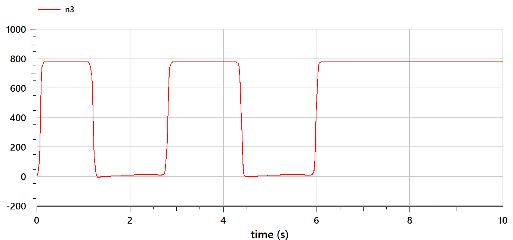

---
## Front matter
title: "Отчёт по лабораторной работе №7"
subtitle: "Эффективность рекламы"
author: "Тасыбаева Н.С."

## Generic otions
lang: ru-RU
toc-title: "Содержание"

## Bibliography
bibliography: bib/cite.bib
csl: pandoc/csl/gost-r-7-0-5-2008-numeric.csl

## Pdf output format
toc: true # Table of contents
toc-depth: 2
lof: true # List of figures
lot: true # List of tables
fontsize: 12pt
linestretch: 1.5
papersize: a4
documentclass: scrreprt
## I18n polyglossia
polyglossia-lang:
  name: russian
  options:
	- spelling=modern
	- babelshorthands=true
polyglossia-otherlangs:
  name: english
## I18n babel
babel-lang: russian
babel-otherlangs: english
## Fonts
mainfont: PT Serif
romanfont: PT Serif
sansfont: PT Sans
monofont: PT Mono
mainfontoptions: Ligatures=TeX
romanfontoptions: Ligatures=TeX
sansfontoptions: Ligatures=TeX,Scale=MatchLowercase
monofontoptions: Scale=MatchLowercase,Scale=0.9
## Biblatex
biblatex: true
biblio-style: "gost-numeric"
biblatexoptions:
  - parentracker=true
  - backend=biber
  - hyperref=auto
  - language=auto
  - autolang=other*
  - citestyle=gost-numeric
## Pandoc-crossref LaTeX customization
figureTitle: "Рис."
tableTitle: "Таблица"
listingTitle: "Листинг"
lofTitle: "Список иллюстраций"
lotTitle: "Список таблиц"
lolTitle: "Листинги"
## Misc options
indent: true
header-includes:
  - \usepackage{indentfirst}
  - \usepackage{float} # keep figures where there are in the text
  - \floatplacement{figure}{H} # keep figures where there are in the text
---

# Подготовила

* Тасыбаева Наталья Сергеевна

* Группа НПИбд-02-20

* Студ. билет 1032201735

# Цель работы

Построить графики эффективности рекламы.

# Задание

Вариант №6

Постройте график распространения рекламы, математическая модель которой описывается следующим уравнением:

$\frac{dn}{dt}= (0.99 + 0.00012n(t))*(N-n(t))$

$\frac{dn}{dt}=  (0.000067 + 0.38n(t))*(N-n(t))$

$\frac{dn}{dt}=  (0.6 * sin(4t) + 0.1 * cos(2t) * n(t))*(N-n(t))$

При этом объем аудитории $N=777$, в начальный момент о товаре знает 1 человек. Для случая 2 определите в какой момент времени скорость распространения рекламы будет иметь максимальное значение.
# Теоретическое введение

## Эффективность рекламы
Организуется рекламная кампания нового товара или услуги. Необходимо, чтобы прибыль будущих продаж с избытком покрывала издержки на рекламу. Вначале расходы могут превышать прибыль, поскольку лишь малая часть потенциальных покупателей будет информирована о новинке. Затем, при увеличении числа продаж, возрастает и прибыль, и, наконец, наступит момент, когда рынок насытиться, и рекламировать товар станет бесполезным.

Предположим, что торговыми учреждениями реализуется некоторая продукция, о которой в момент времени $t$ из числа потенциальных покупателей $N$ знает лишь $n$ покупателей. Для ускорения сбыта продукции запускается реклама по радио, телевидению и других средств массовой информации. После запуска рекламной кампании информация о продукции начнет распространяться среди потенциальных покупателей путем общения друг с другом. Таким образом, после запуска рекламных объявлений скорость изменения числа знающих о продукции людей пропорциональна как числу знающих о товаре покупателей, так и числу покупателей о нем не знающих.

Модель рекламной кампании описывается следующими величинами.
Считаем, что $\frac{dn}{dt}$ - скорость изменения со временем числа потребителей, узнавших о товаре и готовых его купить,
$t$ - время, прошедшее с начала рекламной кампании,
$N$ - общее число потенциальных платежеспособных покупателей,
$n(t)$ - число  уже информированных клиентов.
Эта величина пропорциональна числу покупателей, еще не знающих о нем, это описывается следующим образом
$\alpha _1(t)(N-n(t))$, где $\alpha _1>0$ -  характеризует интенсивность рекламной кампании (зависит от затрат на рекламу в данный момент времени).
Помимо этого, узнавшие о товаре потребители также распространяют полученную информацию среди потенциальных покупателей, не знающих о нем (в этом случае работает т.н. сарафанное радио). Этот вклад в рекламу описывается величиной  $\alpha _2(t)n(t)(N-n(t))$. эта величина увеличивается с увеличением потребителей узнавших о товаре.

Математическая модель распространения рекламы описывается уравнением:

$$\frac{dn}{dt} = (\alpha _1(t) + \alpha _2(t)n(t))(N-n(t))$$

При $\alpha _1(t) >> \alpha _2(t)$ получается модель типа модели Мальтуса.

В обратном случае $\alpha _1(t) << \alpha _2(t)$ получаем уравнение логистической кривой.

[@esystem-lab5]
# Выполнение лабораторной работы

## Решение на OpenModelica

Сперва я написала код на OpenModelica [@openmodelicaODE] и построила графики для первого, второго и третьего случая:


```
model lab7_Tasybaeva
parameter Real a1 = 0.99;
parameter Real b1 = 0.00012;
parameter Real a2 = 0.000067;
parameter Real b2 = 0.38;
parameter Real a3 = 0.6;
parameter Real b3 = 0.1;
parameter Real N = 777;
Real n1(start=1);
Real n2(start=1);
Real n3(start=1);
equation
  der(n1) = (a1+b1*n1) * (N-n1);
  der(n2) = (a2+b2*n2) * (N-n2);
  der(n3) = (a3*sin(4*time)+b3*cos(2*time)*n3) * (N-n3);
end lab7_Tasybaeva;
```
## Результаты, получение с помощью OpenModelica

Графики эффективности реклами в 1 случае (рис. @fig:001).

{#fig:001 width=70%}

Графики эффективности реклами в 2 случае (рис. @fig:002).

{#fig:002 width=70%}

Графики эффективности реклами в 3 случае (рис. @fig:003).

{#fig:003 width=70%}

## Решение на языке julia
Далее я реализовала алгоритм на языке Julia [@juliaODE].

- Код для первого случая

```julia
using Plots
using DifferentialEquations
#вариант 6

a = 0.99
b = 0.00012
N = 777
t = collect(LinRange(0, 10, 500))
n = 1
function syst(dy, y, p, t)
    dy[1] = (a+b*y[1])*(N-y[1])
end
tspan=(0, 15)
prob = ODEProblem(syst, [n], tspan)
sol = solve(prob, saveat = t)
plot(sol,color=:blue, label="n(t)")
savefig("lab7_1.png")

```

- Код для второго случая

```julia
using Plots
using DifferentialEquations
# вариант 6

# Второй случай
a = 0.000067
b = 0.38
N = 777
t = collect(LinRange(0, 10, 500))
n = 1
function syst(dy, y, p, t)
    dy[1] = (a+b*y[1])*(N-y[1])
end
tspan=(0, 15)
prob = ODEProblem(syst, [n], tspan)
sol = solve(prob, saveat = t)
plot(sol,color=:blue, label="n(t)")
savefig("lab7_2.png")

```

- Код для третьего случая

```julia
using Plots
using DifferentialEquations
# вариант 6

# Первый случай
a = 0.6
b = 0.1
N = 777
t = collect(LinRange(0, 10, 500))
n = 1
function syst(dy, y, p, t)
    dy[1] = (a*sin(4*t)+b*cos(2*t)*y[1])*(N-y[1])
end
tspan=(0, 15)
prob = ODEProblem(syst, [n], tspan)
sol = solve(prob, saveat = t)
plot(sol,color=:blue, label="n(t)")
savefig("lab7_3.png")
```

## Результаты, получение с помощью julia

График для первого случая на Julia (рис. @fig:004).

{#fig:004 width=70%}

График для второго случая на Julia (рис. @fig:005).

{#fig:005 width=70%}

График для третьего случая на Julia (рис. @fig:006).

{#fig:006 width=70%}


# Выводы

Я изучила модель эффективности реклами.

# Список используемой литературы {.unnumberd}
