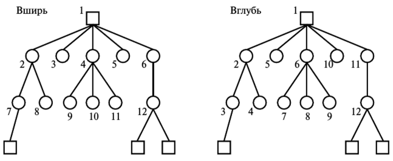

---
## Front matter
lang: ru-RU
title: Доклад
subtitle: Эвристики
author:
  - Тасыбаева Наталья Сергеевна
institute:
  - Российский университет дружбы народов, Москва, Россия
date: 20 марта 2023

## i18n babel
babel-lang: russian
babel-otherlangs: english

## Formatting pdf
toc: false
toc-title: Содержание
slide_level: 2
aspectratio: 169
section-titles: true
theme: metropolis
mainfont: PT Serif
romanfont: PT Serif
sansfont: PT Sans
monofont: PT Mono
header-includes:
 - \metroset{progressbar=frametitle,sectionpage=progressbar,numbering=fraction}
 - '\makeatletter'
 - '\beamer@ignorenonframefalse'
 - '\makeatother'
---

# Эвристика

## Эвристика: понятие и определение

Эвристика - научная область, изучающая специфику созидательной деятельности.

Под термином "эвристика" понимают совокупность приёмов и методов, облегчающих и упрощающих решение познавательных, конструктивных, практических задач. Как наука она развивается на стыке философии, психологии, теории ИИ, теории информации, математики и физики.
Эвристика занимается построением эвристических моделей процесса поиска оригинального решения задач.

## Историческая справка
Термин «эвристический» имеет греческое происхождение и изначально он означал – «то, что позволяет узнать или сделать открытие». 
Значение и смысл термина менялись на протяжении веков. Так, например, определил понятие "эвристика" Альберт Эйнштейн:

Эвристика – это подход к проблеме, который является неполным, в силу имеющихся ограниченных знаний, следовательно, – ложный, однако, с другой стороны, является полезным, с точки зрения определения направления мышления.

## Эвристические модели

Существует множество эвристических моделей. Среди них стоит выделить следующие:
- модель слепого поиска;
- лабиринтная модель;
- структурно-семантическая модель;

## Модель слепого поиска

Модель слепого поиска опирается на метод проб и ошибок. Хорошо известные примеры модели слепого поиска - это поиск в глубину и в ширину.

{ #fig:001 width=60% height=60% }

## Лабиринтная модель
Лабиринтная модель - это модель, в которой задача рассматривается как лабиринт, а поиск решения - как блудание по этому лабиринту.

## Структурно-семантическая модель
Структурно-семантическая модель - это модель, которая исходит из того, что в основе эвристической деятельности по решению задачи лежит принцип построения системы моделей, которая отражает семантические отношения между объектами, входящими в задачу.

## Эвристический алгоритм

Эвристический алгоритм (эвристика) — алгоритм решения задачи, включающий практический метод, не являющийся гарантированно точным или оптимальным, но достаточный для решения поставленной задачи. Позволяет ускорить решение задачи в тех случаях, когда точное решение не может быть найдено.

Примерами могут послужить:
- метод восходящего анализа - решение задачи с конца, от требования - к условию.
- метод суперпозиции - решение задач в частных случаях.
- выделение подзадач, решение которых не составляет труда, внутри основной задачи. Тем самым упрощается структура основной задачи.

# Выводы 

В заключение могу сказать, что эвристика строится на интуитивных методах решения задач, присущих только человеку. 
Однако в современном мире множество операций уже способна выполнять вычислительная техника, и эвристические модели она использует столь же успешно. Тем не менее, любая машина или алгоритм не смогут заменить человеческую могзговую деятельность.
