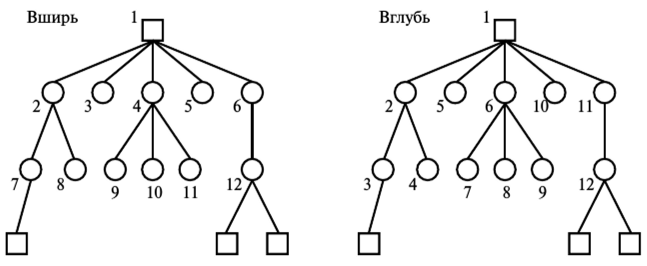

---
## Front matter
title: "Доклад"
subtitle: "Эвристики"
author: "Тасыбаева Н.С."

## Generic otions
lang: ru-RU
toc-title: "Содержание"

## Bibliography
bibliography: bib/cite.bib
csl: pandoc/csl/gost-r-7-0-5-2008-numeric.csl

## Pdf output format
toc: true # Table of contents
toc-depth: 2
lof: true # List of figures
lot: true # List of tables
fontsize: 12pt
linestretch: 1.5
papersize: a4
documentclass: scrreprt
## I18n polyglossia
polyglossia-lang:
  name: russian
  options:
	- spelling=modern
	- babelshorthands=true
polyglossia-otherlangs:
  name: english
## I18n babel
babel-lang: russian
babel-otherlangs: english
## Fonts
mainfont: PT Serif
romanfont: PT Serif
sansfont: PT Sans
monofont: PT Mono
mainfontoptions: Ligatures=TeX
romanfontoptions: Ligatures=TeX
sansfontoptions: Ligatures=TeX,Scale=MatchLowercase
monofontoptions: Scale=MatchLowercase,Scale=0.9
## Biblatex
biblatex: true
biblio-style: "gost-numeric"
biblatexoptions:
  - parentracker=true
  - backend=biber
  - hyperref=auto
  - language=auto
  - autolang=other*
  - citestyle=gost-numeric
## Pandoc-crossref LaTeX customization
figureTitle: "Рис."
tableTitle: "Таблица"
listingTitle: "Листинг"
lofTitle: "Список иллюстраций"
lotTitle: "Список таблиц"
lolTitle: "Листинги"
## Misc options
indent: true
header-includes:
  - \usepackage{indentfirst}
  - \usepackage{float} # keep figures where there are in the text
  - \floatplacement{figure}{H} # keep figures where there are in the text
---

## Эвристика: понятие и определение
```
Эвристика - научная область, изучающая специфику созидательной деятельности.
```
- Эвристика (от древнегреческого ευρίσκω – «отыскиваю», «открываю») – совокупность логических приемов, методов и правил, облегчающих и упрощающих решение познавательных, конструктивных, практических задач. 
- Эвристика – это момент открытия нового, а также методы, которые используются в процессе этого открытия. 
- Эвристикой еще называют науку, которая имеет дело с изучением творческой деятельности. 
- В педагогике под этой категорией подразумевается метод обучения.

Как наука, изучающая творческое, неосознанное мышление человека, эвристика еще полностью не сформировалась. Ее предмет, методы тесно связаны с психологией, философией, физиологией высшей нервной деятельности и другими.

## Легенда возникновения термина "Эвристика"

По легенде, Архимед, принимая ванную, открыл один из главных законов гидростатики – закон вытеснения. Следуя общепринятому мнению, после своего открытия он выкрикнул: «Эврика!», что стало причиной привязки этого слова к открытию.
Правдивость этой теории сомнительна, однако, достоверно известно другое. Именно в Древней Греции зародилась система обучения, называемая эвристикой. Ее автором был Сократ, а сводилась она к сократическим беседам (диалогу, в педагогике – сократический метод) – разговор учителя с учеником, в результате которого путем постановки наводящих вопросов, обучающийся самостоятельно приходит к нужному результату, находит решение задачи, что позволяет также развивать критическое мышление. В то же время, понятие «эвристика» употреблялось и в трактатах древнегреческих математиков (в особенности, Паппа Александрийского, которому многие приписывают первое упоминание этого термина), исходя из чего, можно судить о довольно широкой основе предмета этой отрасли.

Примерно до середины XIX века представления об эвристике как методе творчества и познания в целом сводились к методу проб и ошибок. 

Выделение эвристики из системы логического знания началось в 1850-1860-х гг. До этого попытки выделить эвристику в отдельную науку предпринимались Эвклидом, Р. Декартом, Г. Лейбницем. Но лишь в обозначенный период в науке начал формироваться подход к эвристике как своеобразному междисциплинарному методу со своими правилами, уверены канадские ученые М. Романисия и Ф. Пелатье, разрабатывающие данную проблематику.

В 1905 году Альбертом Эйнштейном был опубликован труд «Об эвристической точке зрения относительно генерации и трансформации света» о квантовой физике. В контексте данного труда понятие «эвристический» используется, чтобы показать, что взгляд, изложенный в труде, является не полным, вероятно, даже неверным, однако он считает его полезным. С точки зрения Эйнштейна эвристика – это подход к проблеме, который является неполным, в силу имеющихся ограниченных знаний, следовательно, – ложный, однако, с другой стороны, является полезным, с точки зрения определения направления мышления.

## Эвристические модели

Эвристические модели, как правило, представляют собой образы, рисуемые в воображении человека. Их описание ведётся словами естественного языка (например, вербальная информационная модель) и, обычно, неоднозначно и субъективно. Эти модели неформализуемы, то есть не описываются формально-логическими и математическими выражениями, хотя и рождаются на основе представления реальных процессов и явлений.

Эвристическое моделирование — основное средство вырваться за рамки обыденного и устоявшегося. Но способность к такому моделированию зависит, прежде всего, от богатства фантазии человека, его опыта и эрудиции. 
Эвристика как наука занимается построением эвристических моделей процесса поиска оригинального решения задачи. Основная задача эвристики сводится к построению моделей осуществления процесса поиска нового для данного субъекта (или общества в целом) решения задачи.

Существуют различные типы таких моделей, среди них в качестве примера можно привести некоторые варианты:

- модель слепого поиска;
- лабиринтная модель;
- структурно-семантическая модель;

Модель слепого поиска опирается на разработанный Торндайком метод проб и ошибок. Слабость модели слепого поиска состоит в невозможности объяснения с ее помощью высокой скорости решения человеком большинства творч. задач. Хорошо известные примеры модели слепого поиска - это поиск в глубину и в ширину.

{ #fig:001 width=60% height=60% }

Одна из самых очевидных стратегий поиска называется поискам в ширину. Поиск начинается с корневой вершины, определяются все последователи корневой вершины, затем все последователи каждого из последователей корневой вершины, далее все последователи каждого из последователей, найденных на предыдущем шаге, и т.д. до тех пор, пока не будут найдены все вершины, соответствующие целевым состояниям.

При поиске в глубину, начиная с корневой вершины (корневая вершина находится на уровне 1), рассматриваются все инцидентные ей вершины уровня 2, начиная слева направо. Если удается найти среди них все целевые вершины, то на этом поиск прекращается. Если среди них не удается найти все целевые вершины, а максимальная глубина дерева еще не достигнута, то берется самая левая вершина уровня 2 и рассматриваются все инцидентные ей вершины уровня 3 слева направо. Если после этого все целевые вершины все еще не найдены, то берется самая левая вершина из уровня 3. Затем снова рассматриваются все инцидентные ей вершины уровня 3 слева направо и так до тех пор, пока либо не будут найдены все целевые вершины, либо достигнута максимальная глубина дерева, на которой в соответствии с рассматриваемой процедурой просмотрены все вершины, инцидентные самой левой вершине предыдущего уровня, и все целевые все еще не найдены. В последнем случае осуществляется подъем по дереву на один уровень вверх, выбор на этом уровне самой левой вершины, инцидентные которой вершины следующего уровня еще не рассмотрены, и поиск дальше среди целевых вершин по тому же принципу. И так до тех пор, пока все вершины дерева не будут рассмотрены.

В настоящее время данная модель в чистом виде редко используется.

```
Лабиринтная модель - это модель, в которой задача рассматривается как лабиринт, а поиск решения - как блудание по этому лабиринту.
```
Суть лабиринтной гипотезы, на которой основана лабиринтная модель, состоит в следующем: переход от исходных данных задачи к решению лежит через лабиринт возможных альтернативных путей. Не все пути ведут к желаемой цели, многие из них заводят в тупик, надо уметь возвращаться к тому месту, где потеряно правильное направление.
Это напоминает попытки не слишком умелого школьника решить задачу об упрощении алгебраических выражений. Для этой цели на каждом шагу можно применять некоторые стандартные преобразования или придумывать искусственные приемы. Но весьма часто вместо упрощения выражения происходит его усложнение, и возникают тупики, из которых нет выхода. По мнению сторонников лабиринтной модели мышления, решение всякой творческой задачи сводится к целенаправленному поиску в лабиринте альтернативных путей с оценкой успеха после каждого шага. С лабиринтной моделью связана первая из метапроцедур- целенаправленный поиск в лабиринте возможностей. Программированию этой метапроцедуры соответствуют многочисленные процедуры поиска, основанные на соображениях здравого смысла (человеческого опыта решения аналогичных задач). В 60-х годах было создано немало программ на основе лабиринтной модели, в основном игровых и доказывающих теоремы "в лоб", без привлечения искусственных приемов. Соответствующее направление в программировании получило название эвристического программирования. Высказывались даже предположения, что целенаправленный поиск в лабиринте возможностей- универсальная процедура, пригодная для решения любых интеллектуальных задач. Но исследователи отказались от этой идеи, когда столкнулись с задачами, в которых лабиринта возможностей либо не существовало, либо он был слишком велик для метапроцедуры поиска, как, например, при игре в шахматы. Конечно, в этой игре лабиринт возможностей- это все мыслимые партии игры. Но как в этом астрономически большом лабиринте найти те партии, которые ведут к выигрышу? Лабиринт столь велик, что никакие мыслимые скорости вычислений не позволят целенаправленно перебрать пути в нем. И все попытки использовать для этого человеческие эвристики (в данном случае профессиональный опыт шахматистов) не дают пути решения задачи. Поэтому созданные шахматные программы уже давно используют не только метапроцедуру целенаправленного поиска, но и другие метапроцедуры, связанные с другими моделями мышления.

Структурно-семантическая модель исходит из того, что в основе эвристической деятельности по решению задачи лежит принцип построения системы моделей, которая отражает структуру связей семантического характера между объектами, образующими "поле" задачи. В процессе построения такой системы моделей субъект осуществляет следующие действия: 
- выделение в потоке входной информации дискретных объектов (селективный отбор объектов); 
- выявление связей между ними (путем прямого наблюдения или проведения рассуждений об этих связях); 
- актуализация тех выделенных множеств. объектов и связей, которые представляют интерес с точки зрения поставленной цели; 
- абстрагирование от неактуальных объектов и связей; 
- формирование обобщенных элементов из однотипных (по актуальным связям) структур; 
- нахождение связей между обобщенными элементами; 
- поиск по полученному обобщенному лабиринту с учетом предшествующего опыта на аналогичных обобщенных лабиринтах. 

В настоящее время созданы и успешно работают программы для ЭВМ, построенные по принципу структурно-семантических моделей. С их помощью удается решать ряд задач оптимального управления сложными системами, которые не могли быть решены с помощью программ, опирающихся на лабиринтную модель.

## Эвристический алгоритм

Эвристический алгоритм — это алгоритм решения задачи, правильность которого для всех возможных случаев не доказана, но про который известно, что он даёт достаточно хорошее решение в большинстве случаев. В действительности может быть даже известно (то есть доказано), что эвристический алгоритм формально неверен. Его всё равно можно применять, если при этом он даёт неверный результат только в отдельных, достаточно редких и хорошо выделяемых случаях или же даёт неточный, но всё же приемлемый результат.

Важно понимать, что эвристика, в отличие от корректного алгоритма решения задачи, обладает следующими особенностями:

- Она не гарантирует нахождение лучшего решения;
- Она не гарантирует нахождение решения, даже если оно заведомо существует (возможен «пропуск цели»);
- Она может дать неверное решение в некоторых случаях.

Эвристические алгоритмы широко применяются для решения задач высокой вычислительной сложности, то есть вместо полного перебора вариантов, занимающего существенное время, а иногда технически невозможного, применяется значительно более быстрый, но недостаточно теоретически обоснованный алгоритм. В областях искусственного интеллекта, таких как распознавание образов, эвристические алгоритмы широко применяются также и по причине отсутствия общего решения поставленной задачи. Различные эвристические подходы применяются в антивирусных программах, компьютерных играх и т. д. 

Следующие методы решения задач в математике являются эвристическими алгоритмами:

- метод восходящего анализа - решение задачи с конца, от требования - к условию.
- метод суперпозиции - решение задач в частных случаях.
- выделение подзадач, решение которых не составляет труда, внутри основной задачи. Тем самым упрощается структура основной задачи.

# Выводы 

В заключение могу сказать, что эвристика строится на интуитивных методах решения задач, присущих только человеку. 
Однако в современном мире множество операций уже способна выполнять вычислительная техника, и эвристические модели она использует столь же успешно. Тем не менее, любая машина или алгоритм не смогут заменить человеческую могзговую деятельность.
